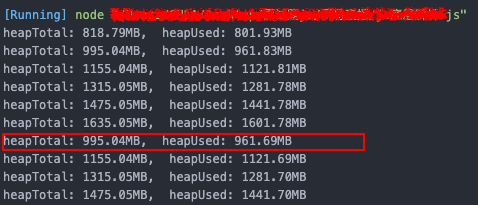

# JS 底层解析

## JS 运行机制
`JavaScript`是单线程的，因为`JavaScript`可以修改`DOM`结构，如果不是单线程，那么可以同时执行多段 `JavaScript`修改`DOM`，那么就会出现`DOM`渲染冲突；

为了避免`DOM`渲染冲突，可以采用单线程或者死锁，`JavaScript`采用了单线程方案；

单线程的问题：如果任务队列里有一个任务耗时很长，导致这个任务后面的任务一直排队等待，就会发生页面卡死，严重影响用户体验

所以`JavaScript`将任务的执行模式分为两种：同步和异步

### JS 执行顺序
先来看一道简单的题目
``` javascript
// 输出顺序？
setTimeout(() => {
  console.log('set1');
})

new Promise((resolve, reject) => {
  console.log('p1');
  resolve();
}).then(() => {
  console.log('then1');
})
console.log('1')
```
很明显答案就是
``` javascript
p1, 1, then1, set1
```
只要清楚JS内部的运行机制其实就可以很轻松的得到答案

首先要明白
浏览器的主要组件包括**调用堆栈，事件循环，任务队列和Web API**。 像`setTimeout`，`setInterval`和`Promise`这样的全局函数不是JavaScript的一部分，而是 **Web API** 的一部分


JS调用栈是后进先出(LIFO - last in first out)的。引擎每次从堆栈中取出一个函数，然后从上到下依次运行代码。每当它遇到一些异步代码，如`setTimeout`，它就把它交给 **Web API(箭头1)**。因此，每当事件被触发时，`callback` 都会被发送到**任务队列（箭头2）**;
**事件循环(Event loop)** 不断地监视 **任务队列(Task Queue)**，并按它们排队的顺序一次处理一个回调。每当调用**堆栈(call stack)**为空时，**Event loop**获取回调并将其放入**堆栈(stack )(箭头3)**中进行处理。请记住，**如果调用堆栈不是空的，则事件循环不会将任何回调推入堆栈**。*

而js中的异步还包含了两种情况，宏任务和微任务

#### 宏任务 & 微任务

- 微任务: `Promise, process.nextTick`
- 宏任务: `第一次执行js代码, 回调函数, setTimeout, setInterval`

**宏任务队列（回调队列）会等待微任务队列全部清空，再执行**

简单的流程图就是这样
``` flow
st=>start: 堆栈
op1=>operation: 微任务队列
cond1=>condition: 微任务队列是否为空？
op2=>operation: task queue
cond2=>condition: task queue是否为空？
event=>operation: event loop
e=>end
st->op1->cond1->op2->cond2->event->e
cond1(yes)->op2
cond1(no)->op1
cond2(yes)->event
cond2(no)->op1
```

此时再回到开头的题目，重新分析：
- 第一次执行：
  - 宏任务队列：`console.log('set1')`
  - 执行`promise`中的`console.log('p1')`，输出`p1`
  - 微任务队列：`console.log('then1')`
  - 执行`console.log('1')`，输出`1`
- 回到微任务队列
  - 执行`console.log('then1')`，输出`then1`
- 回到宏任务队列
  - 执行`console.log('set1')`，输出`set1`

**`Pormise`中的`‘p1’`为同步函数，异步为`then`后面的`‘then1’`*

为了加深理解，把上面的题目再加一层难度
``` javascript
// 输出顺序 ?
setTimeout(() => {
  console.log('set1');
  new Promise((resolve, reject) => {
    console.log('p2');
    resolve();
  }).then(() => {
    console.log('then2');
  })
})

new Promise((resolve, reject) => {
  console.log('p1');
  resolve();
}).then(() => {
  console.log('then1');
  setTimeout(() => {
    console.log('set2');
  });
})
console.log('1')
```

分析：
- 第一次执行：
  - 宏任务队列：
  ``` javascript
  console.log('set1');
  new Promise((resolve, reject) => {
    console.log('p2');
    resolve();
  }).then(() => {
    console.log('then2');
  })
  ```
  - 执行`promise`中的`console.log('p1')`，输出`p1`
  - 微任务队列：
  ``` javascript
  console.log('then1');
  setTimeout(() => {
    console.log('set2');
  });
  ```
  - 执行`console.log('1')`，输出`1`
- 回到微任务队列
  - 执行`console.log('then1')`，输出`then1`
  - 将`console.log('set2')`添加进宏任务队列
- 回到宏任务队列
  - 执行`console.log('set1')`，输出`set1`
  - 执行`promise`中的`console.log('p2')`，输出`p2`
  - 将`console.log('then2')`添加进微任务队列
- 回到微任务队列
  - 执行`console.log('then2')`，输出`then2`
- 回到宏任务队列
  - 执行`console.log('set2')`，输出`set2`

所以，答案就是：
``` javascript
p1, 1, then1, set1, p2, then2, set2
```


## JS 内存

`JavaScript`中的内存空间主要分为三种类型
- **代码空间**：主要用来存放可执行代码
- **栈空间**：存放基本类型数据，引用类型指针，（包括调用栈）
- **堆空间**：存放引用类型数据

### 垃圾回收
`JavaScript`中的垃圾数据都是由垃圾回收器自动回收的，不需要手动释放

#### 栈空间回收
**`JavaScript`引擎通过向下移动`ESP`指针来销毁存放在栈空间中的执行上下文**

在`JavaScript`执行代码时，主线程上会存在`ESP`指针，用来指向调用栈中当前正在执行的上下文；


当`foo`函数执行完成后，`ESP`向下指向全局执行上下文，此时`foo`函数执行上下文已经是无效的了，当有新的执行上下文进来时，可以直接覆盖这块内存空间

#### 堆空间回收
回收流程
- **标记**： 标记堆空间中的活动对象（正在使用）与非活动对象（可回收）
- **垃圾清理**： 回收非活动对象所占用的内存空间
- **内存整理**： 当进行频繁的垃圾回收时，内存中可能存在大量不连续的内存碎片，当需要分配一个需要占用较大连续内存空间的对象时，可能存在内存不足的现象，所以，这时就需要整理这些内存碎片。

**因为内存的是连续存在的，这样势必会导致内存碎片的存在*
*类似于删除数组[1,2,3,4,5]中的2和4，会使得内存变为[1, ,3, ,5]，2和4的位置出现了内存碎片;这样势必导致无法写入其他同类型数据*
*因为数据结构：每一个元素必须同类型并且占用连续的内存；*


##### v8 内存
`v8`中把堆分成新生代与老生代两个区域：
- **新生代**：用来存放生存周期较短的小对象，一般只支持`1～8M`的容量
- **老生代**：用来存放生存周期较长的对象或大对象

`v8`内存大小和操作系统相关
- 64位系统， 1.4g
  - 新生代 - 64mb
  - 老生代 - 1400mb
- 32位系统， 0.7g
  - 新生代 - 16mb
  - 老生代 - 700mb

`v8`内存`1.4g`的设计初衷
- `js`为浏览器脚本语言，只执行一次，执行完毕之后内存就释放掉了，所以`1.4g`够用了
- `v8`回收一次垃圾，`3ms/100mb`，回收的时候是中断所有代码执行，如果占用太多，代码会因`v8`回收停滞很久

`V8`对这两块使用了不同的回收器：
- 新生代 - 副垃圾回收器
- 老生代 - 主垃圾回收器

`v8`会自动执行垃圾回收，但可能会打断`JavaScript`的运行造成页面的卡顿，影响体验，所以`V8`采用**增量标记**算法回收：
把垃圾回收拆成一个个小任务，穿插在`JavaScript`中执行

**新生代回收机制**
- `新生代`空间已经占用25%
- 经历过一次内存回收但仍存在的变量会转移入`老生代`空间（对象晋升策略）

**新生代回收思路（副垃圾回收器）**
`新生代`的变量频繁经历内存回收的洗礼，所以要保证`新生代`执行要快；
因此采用`Scavenge`算法及**对象晋升**策略来s进行垃圾回收

`Scavenge`算法将`新生代空间`空 划分了两部分
- from
- to

每次变量创建在一个分区内，当回收变量发生时，标记将当前分区的存活变量，并复制进入另一分区，然后清空当前分组所有变量；
这样只要经历一次复制的时间即可，保证了速度；
即**翻转对象区域与闲置区域，牺牲了一般空间换取更快的执行速度**

**老生代回收思路（主垃圾回收器）**
主垃圾回收器的回收流程就和之前提到的普通堆空间回收流程一样
- 标记已死亡的变量
- 回收已标记变量
- 整理剩下的变量，防止内存碎片的出现


### 查看内存
- 浏览器 - `window.performance`
- `node` - `process.memoryUsage()`

```js
// 写一个封装内存函数
function getMemory() {
  let memory = process.memoryUsage();
  let format = bytes => (bytes / 1024 / 1024).toFixed(2) + 'MB';
  console.log("heapTotal: " + format(memory.heapTotal) + ",  heapUsed: " + format(memory.heapUsed));
}

// 消耗内存函数
const size = 20 * 1024 * 1024;
let count = 0;
let arr = [];
function tst() {
  let arr1 = new Array(size);
  let arr2 = new Array(size);
  let arr3 = new Array(size);
  let arr4 = new Array(size);
  let arr5 = new Array(size);
}

// 消耗内存
tst();

// 查看内存
getMemory();
let timer = setInterval(() => {
  count++;
  arr.push(new Array(size));
  getMemory();
  // if (count == 10) clearInterval(timer);
}, 1000);
```

每次增加一个新的数，都会增加内存的消耗，直到内存无法容下新的数组的时候，`js`会自动清理内存从而释放内存空间，所以内存突然从`1635MB`下降为了`995MB`

### 容易引发内存使用不当的场景
- 滥用全局变量
  - 用完可以人为释放 `变量 = null`
- 缓存不限制
  - 对缓存对象大小进行限制 `限制arr的长度`
- 操作大文件
  - 断点续传
  - js有相应的api

#### node操作大文件
目前主流读取文件的`api`
- 一次性读取整个文件进入内存（`100mb`）
```js
fs.readFile(); 
```

- 慢慢地传
```js
fs.createReadStream(); // 读取文件流
fs.createWriteStream(); // 写入文件流
```
