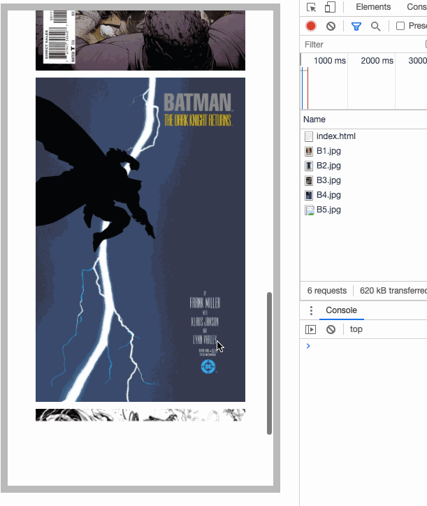

# lazyload
一般而言都是对于图片``进行懒加载，用以提升用户体验

**优点**
- 性能优化
- 节省流量
- 提升用户体验

<!-- more -->

## 原理
在图片进入可视区域之后，再给``附上`src`属性，就可以实现图片的懒加载

### dataset
>`HTMLElement.dataset`属性允许无论是在读取模式和写入模式下访问在 `HTML` 或 `DOM` 中的元素上设置的所有自定义数据属性`data-*`集

先将``的`src`赋值给`data-src`属性，当判断图片进入可视区域，再将`data-src`写入`src`属性

```html

```

```js
const load = el => {
  el.src = el.dataset.src
}
```

>[MDN - dataset](https://developer.mozilla.org/zh-CN/docs/Web/API/HTMLElement/dataset)


### 判断
判断有多种实现方式，总体就是判断图片的位置和当前滚动位置，这里介绍三种方式

- `el.offsetTop < [wrapper].clientHeight + [werapper].scrollTop`
- `el.getBoundingClientRect().top < [wrapper].clientHeight`
- `IntersectionObserver`


## 实现
用上述的三种方法来实现

### `el.offsetTop < [wrapper].clientHeight + [werapper].scrollTop`

>`HTMLElement.offsetTop` 返回当前元素相对于其 `offsetParent` 元素的顶部内边距的距离，`offsetParent` 为上层已定位（`position: ralative / absolute`）元素，若都没有，则为`<body>`

>`HTMLElement.clientHeight` 返回元素内部的高度(单位像素)，包含内边距（不包括水平滚动条、边框和外边距）

>`Element.scrollTop` 获取或设置一个元素的内容垂直滚动的像素数


```js
// 加载图片 下同
const loadImg = el => {
  if (el.src) return
  el.dataset.src && (el.src = el.dataset.src)
}

// 判断是否在可视范围内
const check = el => {
  const scrollTop = wrapper.scrollTop
  return el.offsetTop <= scrollTop + clientHeight
}

const lazyload = () => {
  imgs.forEach(img => {
    check(img) && loadImg(img)
  })
}
```

*注意要先让img列表超出wrapper（给图片定高或者给列表定高大于wrapper），否则无法发动scroll事件*



### `el.getBoundingClientRect().top < [wrapper].clientHeight`

>`Element.getBoundingClientRect()` 方法返回元素的大小及其相对于视口的位置。  
>如果是标准盒子模型（`box-sizing: content-box`），元素的尺寸等于`width/height + padding + border-width`的总和。如果`box-sizing: border-box`，元素的的尺寸等于 `width/height`。  
>并且拥有`left`, `top`, `right`, `bottom`, `x`, `y`, `width` 和 `height` 这几个以像素为单位的只读属性用于描述整个边框。除了 `width` 和 `height` 以外的属性是相对于视图窗口的左上角来计算的


```js
const check = el => el.getBoundingClientRect().top <= clientHeight
```

### `IntersectionObserver`
```js
const io = new IntersectionObserver((entries, ibserver) => { 
  // ...
})
```

使用`IntersectionObserver`实例来监听所有的图片是否进入可视区域（视口），当被监听元素进入视口或离开视口时，都会触发`IntersectionObserver`的`callback`

`callback`有两个参数，`entries`和`observer`，`entries`代表`IntersectionObserverEntry`对象组成的数组，简单来说就是在视口可见性发生变化时的被监听元素组成的数组

当目标元素和可视区域发生交叉时，`IntersectionObserverEntry.isIntersecting`会返回`true`，通过这个属性来判断元素是否出现在视口内，然后`loadImg()`

>[MDN - IntersectionObserver](https://developer.mozilla.org/zh-CN/docs/Web/API/IntersectionObserver/IntersectionObserver)
>[阮一峰 - IntersectionObserver API 使用教程](https://www.ruanyifeng.com/blog/2016/11/intersectionobserver_api.html)

```js
const io = new IntersectionObserver((entries, observer) => {
  entries.forEach(entry => {
    // 元素进入视口内
    if (entry.isIntersecting) {
      const img = entry.target
      // 载入图片
      loadImg(img)
      // 取消监听
      io.unobserve(img)
    }
  })
})

const lazyload = () => {
  imgs.forEach(img => {
    // 监听每个元素
    io.observe(img)
  })
}

lazyload()
```