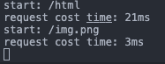
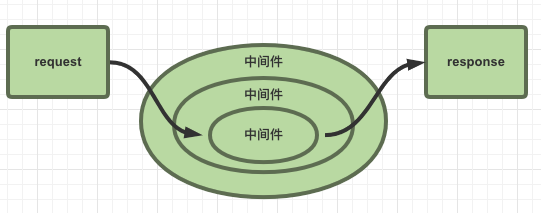

# koa2

[koa官网](https://www.koajs.com.cn/#)

## 概览
node直接开发后端的不足
- 令人困惑的api`request`和`response`
  - `response.end()`
  - `response.writeHead()`
  - ...
- 描述复杂业务逻辑
  - 流程描述
  - 切面描述 AOP

**koa是一个新的web框架，致力于web应用呵api开发**

- 是express的下一代基于nodejs的web框架
- koa2完全使用promise配合async来实现异步

**特点**

- 轻量，无捆绑
- 中间件架构
- 优雅的api设计
- 增强的错误管理

## koa上手
- 安装
```shell
npm i koa -S
```

- 中间件机制
```js
const Koa = require('koa')
const app = new Koa()

// 中间件1
app.use(async (ctx, next) => {
  const start = new Date().getTime()
  console.log(`start ${ctx.url}`)
  // 执行下一个中间件2
  await next()
  // 等内嵌中间件全部执行结束，执行下面的代码
  const end = new Date().getTime()
  console.log(`request cost time: ${end - start}ms`)
})

// 中间件2
app.use(async (ctx, next) => {
  ctx.body = [
    {
      name: 'tom'
    }
  ]
  // 执行下一个中间件3
  await next()
})

// 中间件3
app.use((ctx, next) => {
  console.log('url: ', ctx.url)
  if (ctx.url === '/html') {
    ctx.type = 'text/html;charset=utf-8'
    ctx.body = `<b>my name is ${ctx.body[0].name}</b>`
  }
})

app.listen(3003)
```

*可以将上面的url中间件做成一个路由对象*
```js
const router = {}

router['/html'] = ctx => {
  ctx.type = 'text/html;charset=utf-8'
  ctx.body = `<b>the url is ${ctx.url}, my name is ${ctx.body[0].name}</b>`
}
router['/router1'] = ctx => {
  ctx.type = 'text/html;charset=utf-8'
  ctx.body = `<b>the url is ${ctx.url}, my name is ${ctx.body[0].name}</b>`
}

app.use((ctx, next) => {
  console.log('url: ', ctx.url)
  typeof router[ctx.url] === 'function' ? router[ctx.url](ctx) : ''
})
```

### 常见中间件任务
- 请求拦截
```js
module.exports = async function (ctx, next) {
  const { req } = ctx
  const blackList = ['127.0.0.1']
  const ip = getClientIP(req)
  // 拦截黑名单中的ip
  if (blackList.includes(ip)) {
    ctx.body = "not allowed"
  } else {
    await next()
  }
}

function getClientIP(req) {
  return (
    req.headers["x-forwarded-for"] || // 判断是否有反向代理理 IP
    req.connection.remoteAddress || // 判断 connection 的远程 IP
    req.socket.remoteAddress || // 判断后端的 socket 的 IP
    req.connection.socket.remoteAddress
  )
}
```
- 静态服务
```js
const static = require('koa-static')  // 需要先安装koa-static包
app.use(static(__dirname + '/'))
```

- 路由
```js
const router = require('koa-router')()  // 先安装koa-router包

router.get('/html', async (ctx, next) => {
  ctx.type = 'text/html;charset=utf-8'
  ctx.body = `<b>the url is ${ctx.url}</b>`
})

app.use(router.routes())
```  

- 日志
```js
app.use(async (ctx, next) => {
  const start = new Date().getTime()
  console.log(`start: ${ctx.url}`)
  // 执行下一个中间件
  await next()
  // 等内嵌中间件全部执行结束，执行下面的代码
  const end = new Date().getTime()
  console.log(`request cost time: ${end - start}ms`)
})
```  



## koa2 原理
>[源码](https://github.com/koajs/koa)

手写一个类似于koa的基于nodejs的`http`服务，来理解koa的原理

创建文件
```shell
koa-study
├── app.js        # app文件
└── koa-tst.js    # 自定义koa
```

先在`app.js`文件中写入需要用的一些接口
```js
// app.js
const MY_KOA = require('./koa-tst')
const app = new MY_KOA()

// 中间件
app.use((req, res) => {
  ctx.body = 'hello my koa'
})

// 监听
app.listen(3003, () => {
  console.log('listen@3003')
})
```

- `class MY_KOA`
```js
const http = require('http')

class MY_KOA {
  use(callback) {
    this.callback = callback
  }

  listen(...args) {
    const server = http.createServer((req, res) => {
      this.callback(req, res)
    })
    server.listen(...args)
  }
}

module.exports = MY_KOA
```

### context
koa为了简化API，引⼊上下文`context`，将原始请求对象`request`和响应对象`response`封装并挂载到`context`上，并且在`context`上设置`getter`和`setter`，从而简化操作

<details>
<summary>补充：getter / setter</summary>

```js
const obj = {
  info: { name: 'tom' },
  // 静态定义name的set和get方法
  get name() {
    return this.info.name
  },
  set name(val) {
    this.info.name = val
    console.log('new name is ' + val)
  }
}

console.log(obj.name) // tom
obj.name = 'jerry'  // new name is jerry
console.log(obj.name) // jerry
```

</details>


- 封装request、response、context
```js
// request.js
module.exports = {
  get url() {
    return this.req.url
  },
  get method() {
    this.req.method.toLowerCase()
  }
}

// response.js
module.exports = {
  get body() {
    return this._body
  },
  set body(val) {
    this._body = val
  }
}

// context.js
module.exports = {
  get url() {
    return this.request.url
  },
  get body() {
    return this.response.body
  },
  set body(val) {
    this.response.body = val
  },
  get method() {
    return this.request.method
  }
}
```

- 构建`context`
```js
// koa-tst.js
const http = require('http')
+ const context = require('./context')
+ const request = require('./request')
+ const response = require('./response')

class MY_KOA {
  use(callback) {
    this.callback = callback
  }

  listen(...args) {
    const server = http.createServer((req, res) => {
      // 创建context
+     const ctx = this.createContext(req, res)
+     this.callback(ctx)
+     res.end(ctx.body)
    })
    server.listen(...args)
  }

  // 构建上下文
+ createContext(req, res) {
+   const ctx = Object.create(context)
+   ctx.request = Object.create(request)
+   ctx.response = Object.create(response)
+
+   ctx.req = ctx.request.req = req
+   ctx.res = ctx.response.res = res
+
+   return ctx
+ }

}

module.exports = MY_KOA
```


### 中间件
Koa中间件机制就是函数组合的概念，将⼀组需要顺序执行的函数复合为⼀个函数，外层函数的参数实际是内层函数的返回值

洋葱圈模型可以形象表示这种机制



<details>
<summary>补充：compose</summary>

```js
const add = (x, y) => x + y
const square = z => z * z
```
- 使用普通同步方法
```js
const compose = (...[first, ...others]) => (...args) => {
  let res = first(...args)
  others.forEach(fn => {
    res = fn(res)
  })
  return res
}

const fn = compose(add, square)
console.log(fn(1, 2)) // 9
```

- 更优雅的`reduce`方法
```js
const compose = (...fns) => (...args) => fns.reduce((res, fn) => [fn(...res)], args)

const fn = compose(add, square)
console.log(...fn(1, 2))
```

- 异步方法
```js
function compose(middlewares) {
  return function () {
    // 执行第一个
    return dispatch(0)
    function dispatch(i) {
      let fn = middlewares[i]
      if (!fn) return Promise.resolve()
      return Promise.resolve(
        // 执行当前fn时，将下一个fn的dispatch函数作为参数传进去
        fn(function next() {
          return dispatch(i + 1)
        })
      )
    }
  }
}

// 这里展现了几个中间件函数
async function fn1(next) {
  console.log("fn1")
  await next()
  console.log("end fn1")
}

async function fn2(next) {
  console.log("fn2")
  await delay()
  await next()
  console.log("end fn2")
}

function fn3(next) {
  console.log("fn3")
}

function delay() {
  return new Promise((reslove, reject) => {
    setTimeout(() => {
      console.log('dalay')
      reslove()
    })
  })
}

const middlewares = [fn1, fn2, fn3]
const finalFn = compose(middlewares)
finalFn()

// fn1
// fn2
// dalay
// fn3
// end fn2
// end fn1
```

</details>

在`class`中添加`compose`方法
```js
// koa-tst.js
class MY_KOA {
+ constructor() {
+   this.middlewares = [] // 中间件数组
+ }

  use(middleware) {
    // 将中间件推入数组
+   this.middlewares.push(middleware)
  }

  listen(...args) {
    const server = http.createServer(async (req, res) => {
      // 创建context
      const ctx = this.createContext(req, res)
      // 合并中间件
+     const middleware = this.compose(this.middlewares)
+     await middleware(ctx)
      // 结束响应
      res.end(ctx.body)
    })
    server.listen(...args)
  }
  // ...
  // 合成函数
+ compose(middlewares) {
+   return function (ctx) { // 传⼊上下⽂
+     return dispatch(0)
+     function dispatch(i) {
+       let fn = middlewares[i]
+       if (!fn) return Promise.resolve()
+       return Promise.resolve(
+         // 将上下文和next传⼊中间件，middleware(ctx,next)
+         fn(ctx, function next() {
+           return dispatch(i + 1)
+         })
+       );
+     }
+   };
+ }
}
```

- 中间件的规范
  - 可以是一个`async`函数
  - 接收`ctx`和`next`两个参数
  - 任务结束时执行`next()`触发下一个中间件
```js
const middleware = async (ctx, next) => {
  // ...
  await next()
  // ...
}

app.use(middleware)
```

>补充：[redux, express, koa 中间件实现对比](https://github.com/nanjixiong218/analys-middlewares)

### router
`router`大致的用法如下
```js
const Router = require('./router')
const router = new Router()

router.get('/index', async ctx => { ctx.body = 'index page' })
router.get('/post', async ctx => { ctx.body = 'post page' })
router.get('/list', async ctx => { ctx.body = 'list page' })
router.post('/index', async ctx => { ctx.body = 'post page' })

// 路由实例输出⽗中间件，router.routes()返回一个中间件
const routes = router.routes()
app.use(routes)
```

创建`router`的`class`
```js
// router.js
class Router {
  constructor() {
    this.stack = []
  }

  // 将所有的路由注册进stack数组保存
  register(path, methods, middleware) {
    const route = { path, methods, middleware }
    this.stack.push(route)
  }

  // 调用get和post方法时注册该路由
  get(path, middleware) {
    this.register(path, 'get', middleware)
  }
  post(path, middleware) {
    this.register(path, 'post', middleware)
  }

  // @return { middleware }
  routes() {
    const stack = this.stack
    return async function (ctx, next) {
      let currentPath = ctx.url
      let route
      
      for (let i = 0, len = stack.length; i < len; i++) {
        const { path, methods, middleware } = stack[i]
        if (currentPath === path && methods.indexOf(ctx.method) >= 0) {
          route = middleware
          break
        }
      }

      if (typeof route === 'function') {
        route(ctx, next)
        return
      }
      await next()
    }
  }
}

module.exports = Router
```

### static静态服务
- 配置绝对资源目录地址，默认`'static'`
- 获取文件或者目录信息
- 静态文件的读取
- 返回文件或信息

```js
// static.js
const fs = require('fs')
const path = require('path')

/**
 * @func: 获取静态资源
 * @param {String} dirPath 文件的相对路径，默认为static目录
 * @return {async Function} middleware 
 */
module.exports = (dirpath = './static') => {
  return async (ctx, next) => {
    // 判断url中是否有static关键词
    if (ctx.url.indexOf('/static') === 0) {
      const baseurl = path.resolve(__dirname, dirpath)  // 静态资源目录绝对路径
      const filepath = baseurl + ctx.url.replace('/static', '') // 目标文件绝对路径

      try {
        const filestats = fs.statSync(filepath);
        if (filestats.isDirectory()) {
          const res = []
          const dir = fs.readdirSync(filepath)  // 读取目录，返回目录内文件数组
          dir.forEach(filename => {
            const a = `<a href='${ctx.url}/${filename}'>${filename}</a>`
            if (filename.indexOf('.') >= 0) {
              res.push(`<p>file: ${a}</p>`)
            } else {
              res.push(`<p style="color: red">dir: ${a}</p>`)
            }
          })
          ctx.body = res.join('')
        } else {
          // 文件
          const res = fs.readFileSync(filepath)
          ctx.body = res
        }
      } catch (e) {
        ctx.body = '404 not found'
      }
      return
    }

    // 不是静态资源，调用下一个中间件
    await next()
  }
}

// app.js

const static = require('./static')
app.use(static(__dirname + '/static'))
```

>`path.resolve(path1, path2, ...)`：给定的路径序列从右到左处理，`path1 + path2 + ...`，返回一个拼接后的绝对路径；  
>[path文档](https://nodejs.org/api/path.html) 
>`fs.statSync(path)`：返回`path`文件的基本信息；  
>`fs.readdirSync(path)`： 以数组返回`path`目录内的所有文件名  
>[fs文档](https://nodejs.org/api/fs.html) 

