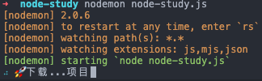
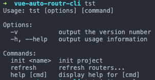

# node 基础

## 概览
node.js是⼀个异步的事件驱动的JavaScript运行环境
>https://nodejs.org/en/

node.js特性其实是JS的特性: 
- 非阻塞I/O
- 事件驱动

node历史 — 为性能⽽生：
>**并发处理** 历史：
>- 多进程 - LinuxC Apache
>- 多线程 - java
>- 异步IO - js
>- 协程 - lua openresty go deno- go TS

>下一代Node deno 
>https://studygolang.com/articles/13101

与前端的不同
- JS核⼼语法不变
- 前端：BOM DOM
- 后端：fs http buffer event os

## 基础配置
- 初始化应用
```shell
# 项目目录内
npm init -y
```

- 运⾏node程序
```shell
node [filename.js]
```

*js文件每次修改户需要重新执行启动才能生效*

```shell
# 安装nodemon可以自动检测文件，一旦改动后保存了，就会自动重新执行
npm i -g nodemon

# 执行js文件
nodemon [filename.js]
```

- 调试node程序
>直接vscode里debug

## 模块

### 常用模块
- 核心模块
  - buffer  用于处理二进制数据流
    - from
    - write
    - contact
    - toString
  - module  模块操作
    - require
    - module.exports
- 内置模块
  - process
  - os
    - freemem 剩余内存
    - ...
  - fs
  - path
  - http
  - event
- 第三方模块

### 使用模块
- 内置模块
```js
// 使用os模块
const os = require('os')
// 计算空内存 / 总内存
const mem = os.freemem() / os.totalmem() * 100
console.log(`内存占用率：${mem.toFixed(2)}%`)
```

- 第三方模块
```shell
#安装第三方模块
npm i [第三方模块名] -S
```

```js
const download = require('download-git-repo')
const ora = require('ora')

const process = ora(`🚀下载...项目`)

process.start()
// 下载github里面的某个项目，保存到./download目录中，成功调用后面额callback函数
download('github:[user_name]/[repository_name]', './download', err => {
  err ? process.fail() : process.succeed()
})
```



- promisify

>异步任务同步化处理

因为上面的`download-git-repo`方法是异步，里面需要回调函数，但是一旦回调嵌套就是地狱了，所以使用内置的`pormisify`方法使之成为链式调用

```js
const repo = 'github:xiannvjiadexiaogouzi/js-practice'
const dir = './download'

async function clone(repo, dir) {
  const { promisify } = require('util')
  const download = promisify(require('download-git-repo'))
  const ora = require('ora')
  const process = ora(`🚀下载...项目`)
  try {
    process.start()
    await download(repo, dir)
  } catch (err) {
    process.fail()
  }
  process.succeed()
}

clone(repo, dir)
```

>`promisify`的简易实现：
>相当于将fn的cb参数变成了一个promise返回
>```js
>module.exports.promisify = function (fn) {
>  // args为fn的参数cb之前的所有参数
>  return function (...args) {
>    return new Promise(function (resolve, reject) {
>      // err为fn的参数cb的第一个参数，剩下的是cb的其他参数
>      args.push(function (err, ...arg) {
>        if (err) {
>          reject(err)
>        } else {
>          resolve(...arg);
>        }
>      });
>      fn.apply(null, args);
>    })
>  }
>}
>```


- 自定义模块
```js
// 导出模块
// ./bar.js
module.exports.foo = function () {/* ... */}

// 引入模块
// ./run.js
const { foo } = require('./bar.js')
```

## 核心api

### fs 文件系统

```js
const fs = require('fs')

// 同步调用
const data = fs.readFileSync('./conf.js')
console.log(data.toString())

// 异步调用
fs.readFile('./conf.js', (err, res) => {
  if (err) throw err
  console.log(res.toString())
})

// 常搭配path
const path = require('path')
fs.readFile(path.resolve(path.resolve(__dirname, './conf.js')), (err, data) => {
  if (err) throw err
  console.log(data)
})

// promisify
const { promisify } = require('util')
const readFile = promisify(fs.readFile)
readFile('./conf.js').then(data => console.log(data))

// fs promise api (node v10)
const fsp = require('fs').promises
fsp.readFile('./conf,js')
  .then(data => console.log(data))
  .catch(err => console.log(err));

// async/await
(async () => {
  const fs = require('fs')
  const readFile = promisify(fs.readFile)
  const data = await readFile('./conf.js')
  console.log(data)
})()

// 引用数据
Buffer.from(data).toString('utf-8')
```

### Buffer
>Buffer ⽤于在 TCP 流、⽂件系统操作、以及其他上下文中与⼋位字节流进行交互。八位字节组成的数组，可以有效的在JS中存储⼆进制数据

```js
// 创建一个⻓度为10字节以0填充的Buffer 
const buf1 = Buffer.alloc(10)
console.log(buf1)

// 创建⼀一个Buffer包含ascii.
// ascii 查询 http://ascii.911cha.com/ 
const buf2 = Buffer.from('a')
console.log(buf2, buf2.toString())

// 创建Buffer包含UTF-8字节
// UFT-8:一种变长的编码⽅案，使⽤用 1~6 个字节来存储;
// UFT-32:一种固定长度的编码⽅案，不管字符编号⼤小，始终使用 4 个字节来存储;
// UTF-16:介于 UTF-8 和 UTF-32 之间，使⽤ 2 个或者 4 个字节来存储，⻓度既固定又可变
const buf3 = Buffer.from('Buffer创建⽅方法')
console.log(buf3)

// 写入Buffer数据 
buf1.write('hello')
console.log(buf1)
// 读取Buffer数据 
console.log(buf3.toString())

// 合并Buffer
const buf4 = Buffer.concat([buf1, buf3])
console.log(buf4.toString())
```

### http
用于创建web服务模块

```js
// 创建一个http服务器
const http = require('http')
const server = http.createServer((req, res) => {
  console.log('this is a request')
  // res本质上是个流
  res.end('response from the server')
})
server.listen(3000)
```
运行该文件访问`localhost:3000`可以看到该服务已经启动

- 创建一个html服务

新建一个服务器中的html页面
```html
<!-- ./index.html -->
<!DOCTYPE html>
<html lang="en">
<head>
  <meta charset="UTF-8">
  <meta name="viewport" content="width=device-width, initial-scale=1.0">
  <title>Document</title>
</head>
<body>
  <h1>this is a html page</h1>
</body>
</html>
```

```js
// html页面服务
const http = require('http')
const fs = require('fs')

const server = http.createServer((req, res) => {
  const { url, method } = req
  // 如果地址正确，就读取index.html文件
  if (url === '/' && method === 'GET') {
    fs.readFile('index.html', (err, data) => {
      if (err) {
        // 修改响应头部
        res.writeHead(500, { 'Content-Type': 'text/plain; charset=utf-8' })
        res.end(`500 server wrong`)
      }
      res.statusCode = 200
      // 设置响应头部
      res.setHeader('Content-Type', 'text/html')
      // 返回读取到的文件
      res.end(data)
    })
    // 接口 /users
  } else if (url === '/user' && method === 'GET') {
    res.writeHead(200, { 'Content-Type': 'application/json' })
    res.end(JSON.stringify([{ name: 'tom', age: 20 }]))
  } else {
    // 404页面
    res.statusCode = 404;
    res.setHeader('Content-Type', 'text/plain;charset=utf-8')
    res.end('404, ⻚面没有找到')
  }
})

server.listen(3003)
```
>`Accept`代表发送端(客户端)希望接受的数据类型。比如：`Accept:text/xml;`代表客户端希望接受的数据类型是xml类型。

>`Content-Type`代表发送端(客户端|服务器)发送的实体数据的数据类型。 ⽐如：`Content-Type:text/html;` 代表发送端发送的数据格式是html。

启动js文件，打开`localhost:3003`就可以看到`index.html`页面了

### stream
stream（流）是node中数据交互的方式  
可以理解为数据流，当读取流`readStream`和书写流`writeStream`用`pipe()`链接起来，就可以实现读写数据

>流数据的方式对二进制很友好，相当于是一个字节一个自己进行边读取边书写的数据交互

```js
const fs = require('fs')
const rs = fs.createReadStream('./B5.jpg')  // 读取流
const ws = fs.createWriteStream('./img2.png') // 书写流
rs.pipe(ws)
```
*这样就相当于复制了一个`./img2.png`*

- 在页面中读取静态资源

在刚才的页面中添加img标签
```html

```
启动之前的http服务刷新页面，此时可以看到，img是无法获取的
```js
const server = http.createServer((req, res) => {
  const {url, method, headers} = request
  if (url === '/' && method === 'GET') {
    // ...
  } else if (method === 'GET' && headers.accept.indexOf('image/*') !== -1) { 
    // 将读取的数据路直接链接给response
    fs.createReadStream('.' + url).pipe(res)
  } else {
    // ... 
  }
}
// ...
```

## 自定义npm模块
>[项目源码](./vue-auto-router-cli)

可以使用以上的node api来创建一个npm包，完成类似于`@vue-cli`的功能
创建`vue-auto-router-cli`目录，并执行`npm`初始化
```shell
# 创建
mkdir vue-auto-router-cli
# 进入目录
cd vue-auto-router-cli
# npm初始化
npm init -y
```

创建`bin`目录，并在其中创建`tst`文件  
*`tst`是一个二进制文件，没有后缀*
```shell
vue-auto-router-cli
├── bin
│   └── tst
└── package.json
```

在`tst`文件中写入
```
#! /usr/bin/env node
console.log('cli...')
```
>`#! /usr/bin/env node`表示使用node环境去执行该文件，接下来就可以用js来写了

修改`package.json`文件，添加如下
```json
"bin":{
  "tst": "./bin/tst"
},
```
将当前包连接到全局的npm中（可能需要sudo权限） 
*相当于用`npm link`模拟了`npm i [当前包] -g`*
```shell
npm link

# 这样就可以直接执行刚才设置的命令了
tst     # 执行start命令
cli...  # 返回index文件中结果
```

>删除该包
>```shell
>ls /usr/local/bin
>rm /usr/local/bin/tst
>```

在`init`文件中引入`commander`包
```js
#!/usr/bin/env node

const program = require('commander')

program.version(require('../package').version, '-v', '--version')
  .command('init <name>', 'init project')
  .command('refresh', 'refresh routers...')
  
program.parse(process.argv)
```
这样就得到了命令行的解释  


创建download功能
```js
// ./lib/download.js
const { promisify } = require('util')
const download = promisify(require('download-git-repo'))
const ora = require('ora')

module.exports.clone = async function (repo, desc) {
  const process = ora(`🚀下载...${repo}`)
  try {
    process.start()
    await download(repo, dir)
  } catch (err) {
    process.fail()
  }
  process.succeed()
}
```

创建`init`命令文件`./tst-init`
```js
#!/usr/bin/env node
const program = require('commander')
const { clone } = require('../lib/download')

const repo = 'github:xiannvjiadexiaogouzi/js-practice'

program.action(async name => {
  console.log(`🚀创建项目: ${name}`)
  await clone(repo, name)
})

program.parse(process.argv)
```

修改文件权限
```shell
chmod +x ./bin/*
```

创建`./publish.sh`发布文件
```shell
#!/usr/bin/env bash
npm config get registry # 检查仓库镜像库
npm config set registry=http://registry.npmjs.org
echo '请进⾏行行登录相关操作:'
npm login # 登陆
echo "-------publishing-------"
npm publish # 发布
npm config set registry=https://registry.npm.taobao.org # 设置为淘宝镜像 echo "发布完成"
exit
```

发布到npm
```shell
# 在项目根目录打开运行发布文件
./publish.sh
```
