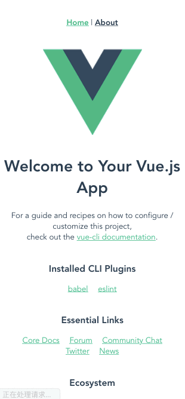

# Skeleton

骨架屏的作用主要是在网络请求较慢时，提供基础占位，当数据加载完成，恢复数据展示。  
这样给用户一种很自然的过渡，不会造成页面长时间白屏或者闪烁等情况。  
常见的骨架屏实现方案有`ssr`服务端渲染和`prerender`两种解决方案  

优势：
- 写于`HTML`文件中，独立于`Vue`框架，节省了`JS`加载时间+`JS`全局环境创建的执行时间的时间
- 只在主页面根据页面结构独立编写，预先展示页面结构，进行视觉暂留，提供更好的交互感官
- 只在页面结构变化时进行修改，维护成本相对较低

## 方案

### 侵入业务手写代码
手写HTML、CSS的方式为目标页定制骨架屏，直接在写业务代码的时候编写骨架屏代码，该代码作为业务代码的一部分

缺点：
- 与业务代码耦合程度高
- 后续维护成本略高：每次修改骨架屏代码都相当于在修改业务代码


### 非侵入业务式手写代码
手写骨架屏代码，使用预渲染（插件），通过`webpack`注入的方式注入到项目源码中

优点： 
- 骨架屏代码和业务代码解耦
- 后续维护成本降低

缺点：
- `webpack`有一定的配置成本

#### vue-server-renderer
使用 `vue-server-renderer` 这个本来用于服务端渲染的插件，用来把写的`.vue`文件处理为`HTML`，插入到页面模板的挂载点中，完成骨架屏的注入  
[Vue页面骨架屏注入实践](https://segmentfault.com/a/1190000014832185)

#### prerender-spa-plugin
[Vue单页面骨架屏实践](https://segmentfault.com/a/1190000012403177)

#### vue-skeleton-webpack-plugin
`vue-skeleton-webpack-plugin`，一款通过预渲染手动书写的代码生成相应的骨架屏插件
[为vue项目添加骨架屏](https://xiaoiver.github.io/coding/2017/07/30/%E4%B8%BAvue%E9%A1%B9%E7%9B%AE%E6%B7%BB%E5%8A%A0%E9%AA%A8%E6%9E%B6%E5%B1%8F.html)


### 非侵入业务式自动代码
`JavaScript`操作`DOM`的方式结合 `Puppeteer` 自动生成网页骨架屏  
[一种自动化生成骨架屏的方案 - eleme](https://github.com/Jocs/jocs.github.io/issues/22)

#### page-skeleton-webpack-plugin
饿了么内部的生成骨架页面的工具：`page-skeleton-webpack-plugin`

#### 淘宝特价版
[一个前端非侵入式骨架屏自动生成方案](https://korbinzhao.github.io/%E5%89%8D%E7%AB%AF%E5%BC%80%E5%8F%91/%E9%AA%A8%E6%9E%B6%E5%B1%8F/2018/06/23/skeleton-auto-generator/)

## 参考
[一种自动化生成骨架屏的方案 - eleme](https://github.com/Jocs/jocs.github.io/issues/22)
[一个前端非侵入式骨架屏自动生成方案 - 淘宝特价版](https://korbinzhao.github.io/%E5%89%8D%E7%AB%AF%E5%BC%80%E5%8F%91/%E9%AA%A8%E6%9E%B6%E5%B1%8F/2018/06/23/skeleton-auto-generator/)
[用纯 DOM 的方式结合 Puppeteer 自动生成网页骨架屏](https://juejin.im/post/5bd5c8edf265da0a951f22aa)

# vue-skeleton-webpack-plugin & vue-cli3 spa 多个skeleton

```shell
npm install vue-skeleton-webpack-plugin
```

目录结构
```shell
.
├── public
├── package.json
├── vue.config.js               # 配置
└── src
     ├── App.vue
     ├── assets
     ├── components
     │   └── HelloWorld.vue
     ├── main.js
     ├── router
     │   └── index.js
     ├── skeleton               # 新建
     │   ├── entry-skeleton.js  # 新建
     │   ├── skeleton1.vue      # 新建
     │   └── skeleton2.vue      # 新建
     └── views
         ├── About.vue
         └── Home.vue
```

```html
<!-- skeleton1.vue -->
<template>
  <div class="skeleton">this is skeleton 1</div>
</template>

<style>
.skeleton {
  display: flex;
  font-size: 2rem;
  padding: 5px;
  animation: skeleton-blink .5s ease-in-out
    infinite;
}

@keyframes skeleton-blink {
  50% {
    opacity: 0.6;
  }
}
</style>
```

```html
<!-- skeleton2.vue -->
<template>
  <div class="skeleton">
    this is skeleton 2
  </div>
</template>
```

```js
// src/skeleton/entry-skeleton.js
import Vue from 'vue';
import Skeleton1 from './skeleton1.vue';
import Skeleton2 from './skeleton2.vue';

export default new Vue({
  components: {
    Skeleton1,
    Skeleton2,
  },

  template: `
       <div style='height: 100%;'>
           <skeleton1 id="skeleton1" style="display:none"/>
           <skeleton2 id="skeleton2" style="display:none"/>
       </div>
    `
});
```

```js
// vue.config.js
const SkeletonWebpackPlugin = require('vue-skeleton-webpack-plugin');
const path = require('path')

module.exports = {
  configureWebpack: {
    plugins: [
      new SkeletonWebpackPlugin({
        webpackConfig: {
          entry: {
            app: path.join(__dirname, './src/skeleton/entry-skeleton.js'),//这里为上面的entry-skeleton.js
          }
        },
        minimize: true,
        quiet: true,
        router: {
          mode: 'hash',
          routes: [
            {
              path: '/', //和router.js中的路径一样就行
              skeletonId: 'skeleton1' //之前的id
            },
            {
              path: '/about',
              skeletonId: 'skeleton2'
            }
          ]
        }
      }),
    ]
  },
  //此插件需要css分离
  css: {
    // 是否使用css分离插件 ExtractTextPlugin
    extract: true,
    // 开启 CSS source maps?
    sourceMap: false,
    // css预设器配置项
    loaderOptions: {},
    // 启用 CSS modules for all css / pre-processor files.
    requireModuleExtension: true
  },
  // ...
}
```

