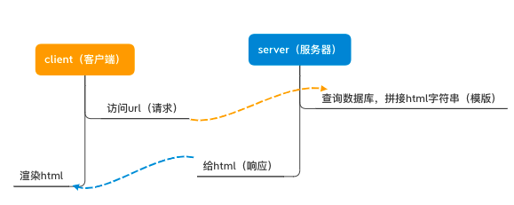
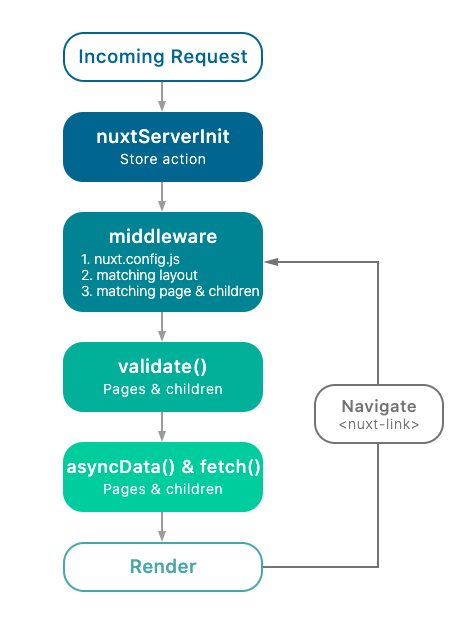
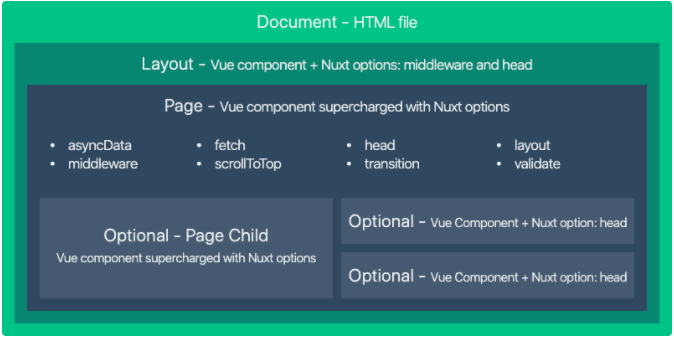

# SSR

## 概念
**传统web服务**，都是由客户端发送请求后，后端根据请求拼接出`html`模板，然后直接发回前端由浏览器，浏览器拿到的就是全部的`dom`结构，直接可以渲染出页面



- 服务端直接渲染完成页面结构，加快了用户的访问体验
- 对搜索引擎更加友好，爬虫直接能获取到页面信息
- **增加了服务端的渲染压力**

**CSR**（client side render），`vue`、`react`时代来临，单页面应用（SPA，single page applicatioin）成为主流，页面整体是客户端`js`渲染出来的  

当页面渲染出来后，页面无需再刷新，只需要请求数据并重新渲染部分`dom`即可

- 首屏渲染时间长
- seo不友好

**SSR**（server side render），结合上面的两种情况，诞生了SSR解决方案，后端渲染出完整的首屏`dom`结构返回，前端拿到内容直接渲染首屏，后续的页面操作在用SPA的方案进行路由跳转和渲染

## 参考
- [vue ssr](https://ssr.vuejs.org/zh/)

## SSR体验 - Nuxt.js
[nuxt.js](https://nuxtjs.org)

Nuxt.js是一个基于vue的通用应用框架  
通过对客户端/服务端基础框架的抽象组织，主要关注的是应用的**UI渲染**

- `nuxtjs`可以用与服务端，也可以用于spa应用开发
- 利用nuxt提供的技术项目结构、路由生成、中间件、插件等特性，可大幅提高开发效率
- `nuxtjs`可用于网站静态化

**渲染流程：**


- **nuxtServerInit**：当前端请求发来时，服务器端开始从数据获取数据并填入`vuex`中
- **middleware**：路由拦截
- **validate**：校验页面
- **asyncData & fetch**：页面渲染之前执行，获取异步数据，获取填充状态

### 安装
```shell
# npx安装相当于一次性安装最新的脚手架工具
npx create-nuxt-app [项目名]

# 启动app
npm run dev
```

### 目录结构

```shell
.
├── assets            # 静态资源目录 不推荐使用
├── components        # vue组件目录，没有像vue一样的asyncData特性
├── layouts           # 布局目录 布局组件
├── middleware        # 中间件
├── pages             # 页面目录 nuxt自动读取该目录下的所有.vue文件并自动生成路由配置
├── plugins           # 插件目录 需要在根vuejs实例化之前运行的js插件
├── static            # 静态文件目录 不被webpack打包，启动项目时该目录会映射到根路径 / 下
├── store             # 状态管理目录 集成vuex功能，创建index.js即可激活
├── node_modules      
├── nuxt.config.js
├── README.md
├── package-lock.json
└── package.json
```

>[更多详情](https://www.nuxtjs.cn/guide/directory-structure)

### 快速使用
#### 路由
- 路由生成

pages⽬录中所有` *.vue` 文件自动⽣成应⽤的路由配置  
*查看`.nuxt/router.js`验证生成路由*

- router-link
```html
// layouts/default.vue
<template>
  <div>
    <nav>
      <!-- nuxt种router-link有多种别名:n-link，NLink，NuxtLink -->
      <nuxt-link to="/">⾸页</nuxt-link>
      <n-link to="/cart">购物车</n-link>
      <NLink to="/admin">管理</NLink>
    </nav>
    <!-- Nuxt标签就相当于一个插槽占位符，所有的pages中的vue组件都会替代这个 -->
    <Nuxt />
  </div>
</template>
```
*nuxt的优化之一就是将这些router-link对应的js文件进行预加载（在首页服务端渲染完成之后，router-link的对应文件会以`<script defer>`的形式进行加载）*
>禁⽤预加载: `<n-link no-prefetch> page not pre-fetched </n-link>`，这样就取消了预加载，实行vue-router的懒加载

- 动态路由
以下划线`_`作为前缀的`.vue`文件或目录会被定义为动态路由
```shell
./pages
├── index.vue
└── detail
    └── _id.vue
```

在router.js中就会自动生成动态路由

```js
// .nuxt/router.js
// ...
{
  path: "/detail/:id?", // 动态路由
  component: _6f1b2940,
  name: "detail-id"
}, 
// ...
```

而具体在`.vue`文件中的用法，几乎原来如出一辙

```html
// pages/index.vue
<n-link :to="`/detail/${good.id}`">
  {{ good.name }}
</n-link>

// pages/detail/_id.vue
<p>{{$route.params.id}}</p>
```

- 路由嵌套

创建内嵌子路由，添加⼀个`.vue`文件，同时添加一个与该文件同名的目录用来存放⼦视图组件
```shell
./pages
├── index.vue
├── detail.vue  # detail组件需要嵌套子组件
└── detail      # 与detail组件同名目录，下面保存子组件
    └── _id.vue
```
这样`_id.vue`就作为子路由嵌套进`detail`组件中

```js
// pages/detail.vue
// 用nuxt-child标签来代替嵌套的子路由组件
<nuxt-child></nuxt-child>
```

- 扩展配置路由
```js
// nuxt.config.js
export default {
  // ...
  router: {
    // 扩充routes
    extendRoutes (routes, resolve) {
      // routes 为所有的路由对象数组
      // resolve 为获取组件l路径
      routes.push({
        name: 'foo',
        path: '/foo,
        component: resolve(__dirname, 'pages/custom.vue')
      })
    }
  } 
  // ...
}
```

#### 视图


- layout 默认布局
这样默认的布局在每个页面上都可以呈现出来
```html
// layouts/default.vue
<template>
  <!-- 每个页面又有nav和footer表看显示 -->
  <nav />
  <!-- nuxt标签替换了vue组件 -->
  <nuxt />
  <footer />
</template>
```

- 自定义布局
新建了其他布局，用于特定页面
```shell
./layouts
├── default.vue
└── blanket.vue  # 新建的blanket布局
```
如果想要指定某组件使用特定布局
```js
// pages/login.vue
export default {
  layout: 'banket', // 指定与特定布局文件同名
}
```

- 自定义错误页面
通过自定义布局可以穿件自定义的404页面
```vue
<template>
  <div class="container">
    <h1 v-if="error.statusCode === 404">⻚面不存在</h1>
    <h1 v-else>应用发⽣错误异常</h1>
    <nuxt-link to="/">⾸页</nuxt-link>
  </div>
</template>

<script>
export default {
  // nuxt会自动传递一个error对象，可以根据error对象的信息来处理页面内容
  props: ['error']
}
</script>
```

- 页面

nuxt的页面就是vue组件，但是nuxt还添加了一些特殊的配置项可以用来自定义html`<head>`和`属性`
```js
export default {
  // 修改页面头部信息
  head() {
    return {
      title: "课程列列表",
      // 配置meta信息
      meta: [{ name: "description", hid: "description", content: "set page meta" }],
      link: [{ rel: "favicon", href: "favicon.ico" }],
    }; 
  },
};
```

>[更多详情](https://www.nuxtjs.cn/guide/views#html-%E5%A4%B4%E9%83%A8)

#### 页面api
>[更多详情](https://www.nuxtjs.cn/api)

|api|description|
|--|--|
|asyncData|最重要选项，该方法的第一个参数为当前页面组件的上下文对象|
|fetch|与asyncData类似，用于在渲染页面之前获取数据填充应用的状态树（store）；不同的是，fetch不会设置组件的数据|
|head|配置当前页面的Meta标签|
|layout|指定当前页面使用的布局文件（layouts目录下的文件）|
|loading|{Boolean}：false，阻止页面自动调用`this.$nuxt.$loading.finish()`和`this.$nuxt.$loading.start()`，可以手动在`nuxt.config.js`中设置`loading`属性调用|
|transition|指定页面的切换过渡动效|
|scrollToTop|{Boolean}：默认false，用于判定渲染页面前是否需要将当前页面滚动至顶部（用于嵌套路由的场景）|
|validate|用于校验动态路由的参数|
|--|--|
|--|--|

#### 异步数据
`asyncData`可以在设置组件数据之前异步获取或处理数据； 

`asyncData`发生在`beforeCreate`之前，在首次请求首页的时候，`asyncData`数据请求会先发生在服务端，拿到数据后由服务器将整个首页传给浏览器；  

*但这仅仅是在首页渲染的时候，如果首页渲染完成之后重新进入首页，那么`asyncData`的数据获取就会由浏览器端完成*

- 准备模拟接口

安装依赖
```shell
npm i koa koa-router koa-bodyparser -S
```

创建接口模拟文件
```js
// server/api.js
const koa = require('koa')
const app = new koa()
// 处理post请求参数的模块
const bodyparser = require('koa-bodyparser')
// 路由的配置，所有api增加前缀 '/api'
const router = require('koa-router')({ prefix: '/api' })

// 设置cookie密钥
app.keys = ['some secret', 'another secrect']

const goods = [
  { id: 1, name: "cup", price: 999 },
  { id: 2, name: "apple", price: 9 },
  { id: 3, name: "orange", price: 9 },
  { id: 4, name: "water", price: 99 },
]

// 设置路由
// /api/goods
router.get('/goods', ctx => {
  ctx.body = {
    ok: 1,
    goods
  }
})

// /api/detail
router.get('/detail', ctx => {
  ctx.body = {
    ok: 1,
    data: goods.find(good => good.id === ctx.query.id)
  }
})

// /api/login
router.post('/login', ctx => {
  const user = ctx.request.body
  if (user.username === "jerry" && user.password === "123") {
    // 将token存入cookie
    const token = 'a mock token'
    ctx.cookies.set('token', token)
    ctx.body = { ok: 1, token }
  } else {
    ctx.body = { ok: 0 }
  }
})

// 解析post数据
app.use(bodyparser())
// 注册路由
app.use(router.routes())

app.listen(8080, () => console.log('server api:8080 ok!'))
```

- 整合axios

安装`@nuxt/axios`模块，这是官方提供的axios模块，可以自动注入到`context`对象中
```shell
npm i @nuxtjs/axios -S
```

配置axios
```js
// nuxt.config.js
export default {
  // ...
  modules: ['@nuxtjs/axios'],
  axios: { proxy: true },
  proxy: { '/api': 'http://localhost:8080' },
  // ...
}
```

- 获取数据

`asyncData`的第一个参数为[context上下文](https://www.nuxtjs.cn/api/context)，包括了很多其他的属性

其返回的数据会于`data()`合并，且优先级大于`data()`

*`asyncData`里面不能使用`this`访问组件实例，因为发生在`beforeCreate`之前*


```js
// pages/inex.vue
export default {
  // 传递第一个参数context
  // $axios自动注入，无需import进来
  async asyncData({ $axios, error }) {
  const { ok, goods } = await $axios.$get("api/goods");
  if (ok) {
    // 和data()一样，直接返回数据即可
    return {
      goods,
    };
  }
  // 错误处理
  // error函数自动重定向到一个错误页面
  error({statusCode: 400, message: '数据查询失败'})
// ...
}
```

>[更多详情](https://www.nuxtjs.cn/guide/async-data)

#### 中间件
中间件会在一个页面或一组页面渲染之前运行其中的函数，常用于权限控制、校验等

中间件第一参数为`context`

*中间件的文件名即该中间件的名字（middleware/auth.js => auth中间件）*

- 权限auth中间件
```js
// middleware/auth.js
export default function ({ route, redirect, store }) {
  // 通过vuex中令牌存在与否判断是否登录
  if (!store.state.user.token) {
    // 重定向到登陆页面，并且用route.query来保存本来要转跳的地址
    redirect("/login?redirect=" + route.path);
  }
}

// 在特定的文件中使用
// pages/admin.vue
export default {
  middleware: ['auth'],
}

// 全局注册
// nuxt.config.js
module.exports = {
  router: {
    middleware: ['auth'],
  }
}
```

>[更多详情](https://www.nuxtjs.cn/guide/routing#%E4%B8%AD%E9%97%B4%E4%BB%B6)

#### store
在store目录中创建store文件，其文件名就是对应的vuex中的store模块名

- store模块化
```js
// store/user.js
export const state = () => ({
  token: '',
})

export const mutations = {
  init(state, token) {
    state.token = token
  }
}

export const getters = {
  isLogin(state) {
    return !!state.token
  }
}

export const actions = {
  login({ commit, getters }, user) {
    return this.$axios.$post('/api/login', user)
      .then(({ token }) => {
        if (token) {
          commit("init", token)
        }
        return getters.isLogin
      })
  }
}

// pages/login.vue
export default {
  methods: {
    onLogin() {
      this.$store.dispatch("user/login", this.user).then((ok) => {
        const redirect = this.$route.query.redirect || "/";
        this.$router.push(redirect);
      });
    }
  }
}
```

- nuxtServerInit

当页面刷新的时候，store的状态树也随之清空，这时可以用`nuxtServerInit`，这个action方法只在服务端执行一次，并且将`context`作为第二参数传递，这样可以将服务器端的一些数据直接初始化到客户端

*只在store主模块`store/index.js`才生效，且只在服务端运行一次*

>使用 [cookie-universal-nuxt](https://github.com/microcipcip/cookie-universal/tree/master/packages/cookie-universal-nuxt) 这个库来在服务端获取cookie数据

```shell
# 安装插件
npm i cookie-universal-nuxt -S
```

```js
// nuxt.config.js
export default {
   modules: ['cookie-universal-nuxt'],
}
```

```js
// store/index.js
export const actions = {
  nuxtServerInit({ commit }, { app }) {
    // $cookie为cookie-universal-nuxt模块提供的api
    const token = app.$cookies.get('token')
    if (token) {
      commit('user/init', token)
    }
  }
}
```

>[更多详情](https://www.nuxtjs.cn/guide/vuex-store)

#### 插件
nuxtjs会在运行应用之前执行插件函数，适用于引入、设置vue插件、自定义模块、第三方模块

插件在`plugins`目录下创建，并且只在nuxt初始化时执行一次

- 添加请求拦截器，附加token
```js
// plugins/interceptor.js
export default function ({ $axios, store }) {
  $axios.onRequest(config => {
    if (store.state.user.token) {
      // 添加请求头的Authorizatio: toekn
      config.headers.Authorization = "Bearer " + store.state.user.token
    }
    return config
  })
}

// 注册插件
// nuxt.config.js
{
  plugins: ['@/plugins/interceptor']
}
```

>[更多详情](https://www.nuxtjs.cn/guide/plugins)


### 发布部署
```shell
# 编译构建
npm run build

# 启动nuxt服务
npm start
```

*生成的内容都在`.nuxt/dist`中*

#### 静态应用部署
nuxtjs可以根据路由配置将应用静态化
```shell
npm run generate
```

*生成的内容都在`dist`中*

