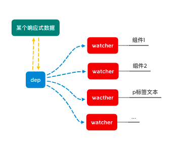

# Vue 响应式原理 && 如何实现MVVM双向绑定

## 原文 
本文原文发布于[原文](https://segmentfault.com/a/1190000021013153)

## 前言
众所周知，Vue.js的响应式就是用了**数据劫持 + 发布-订阅模式**，然而深其意，身为小白，每每感觉自己能回答上来，最后去有欲言又止以失败告终；作为经典的面试题之一，大多数情况下，也都只能答到“用`Object.defineProperty`...”这种地步

所以写下这篇来为自己梳理一下响应式的思路

## 什么是MVVM
**Model，View，View-Model**就是mvvm的的含义；

- `View` 通过`View-Model` 的 `DOM Listeners` 将事件绑定到 `Model` 上
- `Model` 则通过 `Data Bindings` 来管理 `View` 中的数据
- `View-Model` 从中起到一个连接桥的作用

## 响应式
依照mvvm模型说的，当model（data）改变时，对应的view也会自动改变，这就是响应式
举个🌰
```
// html

<div id="app">
  <input type="text" v-model='c'>
  <p>{{a.b}}</p>
  <div>my message is {{c}}</div>
</div>
```
```
// js

let mvvm = new Mvvm({
  el: '#app',
  data: {
    a: {
      b: '这是个例子'
    },
    c: 10,
  }
});
```

### 原理
>当一个 `Vue` 实例创建时，`vue` 会遍历 `data` 选项的属性，用 `Object.defineProperty` 将它们转为 `getter/setter` 并且在内部追踪相关依赖，在属性被访问和修改时通知变化。
>每个组件实例 / 元素都有相应的 `watcher` 程序实例，它会在组件渲染的过程中把属性记录为依赖，之后当依赖项的 `setter` 被调用时，会通知 `watcher` 重新计算，从而致使它关联的组件得以更新


总结，最重要就是三个步骤
- **数据劫持**
用 `Object.defineProperty` 为每个数据设置 `getter/setter`
- **数据渲染**
扫面所有组件识别`v-`指令和`{{}}`插值，替换成对应的数据
- **发布订阅**
为页面使用到数据的每个组件都添加一个观察者（依赖） `watcher`；
为每个数据添加订阅者（依赖收集器）`dep`，并将对应的观察者（依赖） `watcher`添加进依赖列表，每当数据更新时，订阅者（依赖收集器）通知所有对应观察者（依赖）自动更新对应页面

## 实现一个MVVM
### 思路
通过以上，我们知道了大概的mvvm运作原理，对应以上分别实现其功能即可  
1. 一个**数据监听**器 `Observer`，对数据的所有属性进行监听，如有变动就通知订阅者`dep`
2. 一个**指令解析/渲染**器 `Compile`，对每个元素节点的指令进行扫描和解析，对应替换数据，以及绑定相应的更新函数
3. 一个**依赖** `Watcher`类和一个**依赖收集器** `dep`类
4. 一个`mvvm`类


### Mvvm
我们要打造一个Mvvm，根据之前我们mvvm的例子
```js
class Mvvm {
  constructor(option) {
    this.$option = option;
    // 初始化
    this.init();
  }

  init() {
    // 数据监控
    observe(this.$option.data);
    // 编译
    new Compile(this.$option.el);
  }
}
```

### 数据监听
这里我只写了一个函数，用类写也是可以的
```js
/* observe监听函数，监听data中的所有数据并进行数据劫持
 * @params
 * $data - mvvm实例中的data
 */
function observe(data) {
  // 判断是不是对象
  if (typeof data !== 'object') return
  // 循环数据
  Object.keys(data).forEach(key => {
    defineReactive(data, key, data[key]);
  })

  /* 
    @function 数据劫持 defineReactive
    @params
    obj - 监听对象; key - 遍历对象的key; val - 遍历对象的val
   */
  function defineReactive(obj, key, val) {
    // 递归子属性
    observe(val);
    // 数据劫持
    Object.defineProperty(obj, key, {
      enumerable: true, // 可枚举
      configurable: true, // 可修改
      // 设置getter 和 setter 函数来对数据劫持
      get() {
        console.log('get!', key, val);
        return val
      },
      set(newVal) {
        // 监听新数据
        observe(newVal);
        console.log('set!', key, newVal);
        val = newVal; // 赋值
      },
    })
  }
}
```
>这里的`getter`和`setter`就是典型的闭包，使用闭包来处理数据，当访问或者修改数据的时候，返回或者修改的永远是闭包内的变量

然而单纯这样写是不够的，因为有数组这样的特例： 

`Object.defineProperty`严格上来说是可以监听数组的变化, 但对于数组增加`length`而造成的的变化（原型方法）无法监听到的； 

简单来说就是当使用数组原型方法来改写数组的时候，虽然数据被改写了，但是我们无法监听到数组本身的改写；  
所以，在`Vue`中重写了数组的原型方法  

```js
let methods = ['pop', 'shift', 'unshift', 'sort', 'reverse', 'splice', 'push'];
// 先获取原型上的方法, 然后创造原型重写
let arrProto = Array.prototype;
let newArrProto = Object.create(arrProto);
methods.forEach(method => {
  newArrProto[method] = function (...args) {
    console.log('arr change!')
    // 用 function 定义该函数使得 this 指向调用的数组；如果用箭头函数 this 会指向 window
    arrProto[method].call(this, ...args)
  }
})

// 数据劫持
function observe(data) {
  // 判断是否是数组类型
+ if (Array.isArray(data)) {
+   // 将数组数据原型指针指向自己定义好的原型对象
+   data.__proto__ = newArrProto;
+   return
+ }
  ...
}
```
然而，这样还存在限制，那就是`Vue`无法检测到对象属性的添加或删除；  
所以在`Vue`中使用了`Vue.set`和`Vue.delete`来弥补响应式；  
这个我们就略过了，以后有空再补  

### 指令解析
```js
/* Compile类，解析dom中所有节点上的指令
 * @params
 * $el - 需要渲染的标签
 * $vm - mvvm实例
 */
class Compile {
  constructor(el, vm) {
    this.vm = vm;
    this.$el = document.querySelector(el); // 挂载到编译实例方便操作
    this.frag = document.createDocumentFragment(); // 运用fragment类进行dom操作以节省开销
    this.reg = /\{\{(.*?)\}\}/g;

    // 将所有dom节点移入frag中
    while (this.$el.firstChild) {
      let child = this.$el.firstChild;
      this.frag.appendChild(child);
    }
    // 编译元素节点
    this.compile(this.frag);
    this.$el.appendChild(this.frag);
  }
}
```
这样一个编译函数框架就写好了，然后需要对里面的详细函数功能进行补充；  
因为我们需要在循环节点的时候识别文字节点上的`{{xxx}}`插值。。。  
```js
class Compile {
  ...
  // 编译
  compile(frag) {
    // 遍历 frag node节点
    Array.from(frag.childNodes).forEach(node => {
      let txt = node.textContent;
      
      // 编译文本 {{}}
      if (node.nodeType === 3 && this.reg.test(txt)) {
        this.compileTxt(node, RegExp.$1);
      }

      // 递归子节点
      if (node.childNodes && node.childNodes.length) this.compile(node)
    })
  }

  // 编译文字节点
  compileTxt(node, key) {
    node.textContent = typeof val === 'undefined' ? '' : val;
  }
  // ...
}
```
到这里，初次渲染页面的时候，`mvvm`已经可以把实例里面的数据渲染出来了，但是还不够，因为我们需要她可以实时自动更新

### 发布订阅
当一个数据在`node`上有多个节点/组件同时引用的时候，该数据更新时，我们如何一个个的去自动更新页面？这就需要用到发布订阅模式了；  
我们可以在编译的时候为页面使用到数据的每个组件都添加一个观察者（依赖）`watcher`；  
再为每个数据添加一个订阅者（依赖收集器）`dep`，并将对应的观察者（依赖）`watcher`添加进依赖列表，每当数据更新时，订阅者（依赖收集器）通知所有对应观察者（依赖）自动更新对应页面  



所以需要创建一个`Dep`，它可以用来收集依赖、删除依赖和向依赖发送消息  

#### Dep
```js
class Dep {
  constructor() {
    // 创建一个数组，用来保存所有的依赖的路径
    this.subs = [];
  }
  // 添加依赖 @sub - 依赖（watcher实例）
  addSub(sub) {
    this.subs.push(sub);
  }
  // 提醒发布
  notify() {
    this.subs.forEach(el => el.update())
  }
}
```

#### Watcher
```js
// 观察者 / 依赖
class Watcher {
  constructor(vm, key, cb) {
    this.vm = vm;
    this.key = key;
    this.cb = cb;
    // 初始化时获取当前数据值
    this.value = this.get(); 
  }
  /* 获取当前值
   * @param $boolean: true - 数据更新 / false - 初始化
   * @return 当前的 vm[key]
   */
  get(boolean) {
    Dep.target = boolean ? null : this; 
    // 触发getter，将自己添加到 dep 中
    let value = UTIL.getVal(this.vm, this.key);
    Dep.target = null;
    return value;
  }
  update() {
    // 取得最新值； // 只有初始化的时候触发，更新的时候不触发getter
    let nowVal = this.get(true);
    // 对比旧值
    if (this.value !== nowVal) {
      console.log('update')
      this.value = nowVal;
      this.cb(nowVal);
    }
  }
}
```
再回到`Compile`中，我们需要在第一遍渲染的时候还将为该组件创建一个`wacther`实例；  
然后再将渲染更新的函数放到`watcher`的`cb`中；  
```js
class Compile{
  ...
  // 编译文字节点
  compileTxt(node, key) {
+   this.bind(node, this.vm, key, 'text');
  }

+ // 绑定依赖
+ bind(node, vm, key, dir) {
+   let updateFn = this.update(dir);
+   // 第一次渲染
+   updateFn && updateFn(node, UTIL.getVal(vm, key));
+   // 设置观察者
+   new Watcher(vm, key, (newVal) => {
+     // cb 以后的渲染
+     updateFn && updateFn(node, newVal);
+   });
+ }

+ // 更新
+ update(dir) {
+   switch (dir) {
+     case 'text': // 文本更新
+       return (node, val) => node.textContent = typeof val === 'undefined' ? '' : val;
+       break;
+   }
+ }
  ...
}
```
完成这些，回到原来`defineReactive`中，对其进行修改，为每个数据都增添一个`dep`实例； 
并在`getter`中为`dep`实例添加依赖；在`setter`中添加`dep`实例的发布函数；  
```js
function observe(data) {
  ...
  function defineReactive(obj, key, val) {
    // 递归子属性
    observe(val);
    // 添加依赖收集器
+   let dep = new Dep();
    // 数据劫持
    Object.defineProperty(obj, key, {
      enumerable: true, // 可枚举
      configurable: true, // 可修改
      get() {
        console.log('get!', key, val);
        // 添加订阅
+       Dep.target && dep.addSub(Dep.target);
        return val
      },
      set(newVal) {
        observe(newVal);
        console.log('set!', key, newVal);
        val = newVal;
        // 发布更新
+       dep.notify(); // 触发更新
      },
    })
  }
}
```
至此，一个简易的响应式`Mvvm`已经实现了，每当我们修改数据的时候，其对应的页面内容也会自动重新渲染更新；  
那么双向绑定又是如何实现的呢？  

### 双向绑定
双向绑定就是在`Compile`的时候，对`node`的元素节点进行识别，如果有`v-model`指令，则对该元素的`value`值和响应数据进行绑定，并在`update`函数中添加对应的`value`更新方法
```js
class Compile {
  // 编译
  compile(frag) {
    // 遍历 frag node节点
    Array.from(frag.childNodes).forEach(node => {
      let txt = node.textContent;

      // 编译元素节点
+     if (node.nodeType === 1) {
+       this.compileEl(node);
+     // 编译文本 {{}}
      } else if (node.nodeType === 3 && this.reg.test(txt)) {
        this.compileTxt(node, RegExp.$1);
      }

      // 递归子节点
      if (node.childNodes && node.childNodes.length) this.compile(node)
    })
  }
  ...
+ compileEl(node) {
+   // 查找指令 v-xxx
+   let attrList = node.attributes;
+   if (!attrList.length) return;
+   [...attrList].forEach(attr => {
+     let attrName = attr.name;
+     let attrVal = attr.value;
+     // 判断是否带有 ‘v-’ 指令
+     if (attrName.includes('v-')) {
+       // 编译指令 / 绑定 标签value和对应data
+       this.bind(node, this.vm, attrVal, 'model');
+       let oldVal = UTIL.getVal(this.vm, attrVal); // 获取 vm实例 当前值
+       // 增添input事件监听
+       node.addEventListener('input', e => {
+         let newVal = e.target.value; // 获取输入的新值
+         if (newVal === oldVal) return;
+         UTIL.setVal(this.vm, attrVal, newVal);
+         oldVal = newVal;
+       })
+     }
+   });
+ }
  ...
  // 更新
  update(dir) {
    switch (dir) {
      case 'text': // 文本更新
        return (node, val) => node.textContent = typeof val === 'undefined' ? '' : val;
        break;
+     case 'model': // model指令更新
+       return (node, val) => node.value = typeof val === 'undefined' ? '' : val;
+       break;
    }
  }
}
```
简单来说，双向数据绑定就是给有`v-xxx`指令组件添加`addEventListner`的监听函数，一旦事件发生，就调用`setter`，从而调用`dep.notify()`通知所有依赖`watcher`调用`watcher.update()`进行更新

## 总结
动手实现Mvvm的过程如下
- 利用`Object.defineProperty`的`get`和`set`进行数据劫持
- 利用`observe`遍历data数据来进行监听，并为数据创建`dep`实例来收集依赖
- 利用`Compile`对`dom`中的所有节点进行编译，并为组件添加`wathcer`实例
- 通过`dep`&`watcher`发布订阅模式实现数据与视图同步

## 项目源码
欢迎移步项目[源码](https://github.com/xiannvjiadexiaogouzi/note/blob/master/vue-learn/mvvm/mvvm.html)

**参考**
- [Vue源码详细解析:transclude,compile,link,依赖,批处理...一网打尽，全解析!](https://segmentfault.com/a/1190000008500946#articleHeader5)
- [不好意思！耽误你的十分钟，让MVVM原理还给你](https://juejin.im/post/5abdd6f6f265da23793c4458#heading-10)
- [剖析Vue原理&实现双向绑定MVVM](https://segmentfault.com/a/1190000006599500#articleHeader4)


## 最后
感谢阅读  
欢迎指正、探讨  
😀 各位喜欢的看官，欢迎 star 🌟

