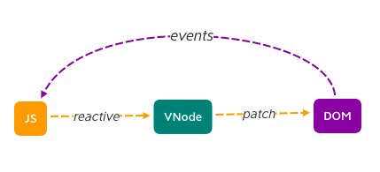
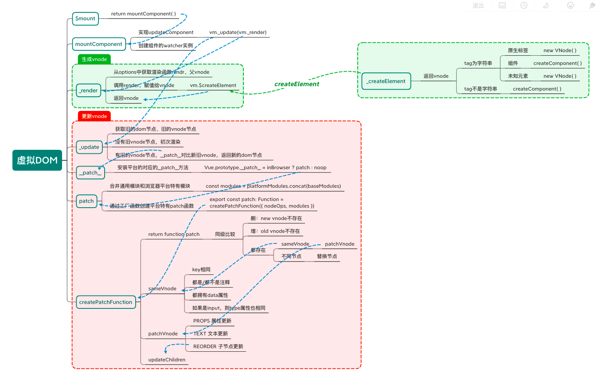
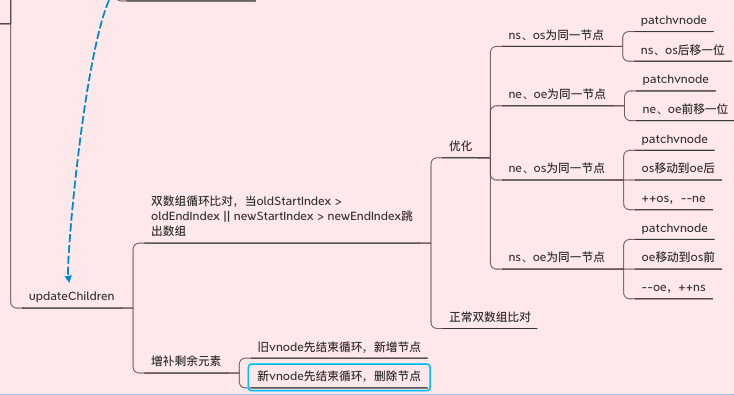

# 虚拟DOM & Diff算法
虚拟`DOM`（virtual dom）是用`js`抽象表达`dom`，是一个`js`对象用来描述`dom`结构和关系。应用的各种状态变化会作用于虚拟`dom`，最终映射到真实`dom`上

- 通过对比新旧`vnode`，得到最小`dom`操作量，提升性能和用户体验
- 本质上是使用`js`运算成本代替部分`dom`操作成本



- `vue 1.0`中有细粒度的数据变化侦测，不需要虚拟dom，但是细粒度造成了大量的开销（*每个响应式数据引用都有一个`watcher`，数据以及数据引用越多，`watcher`越多，性能开销越大*），无法很好的支持大型项目
- `vue 2.0`选择了中粒度的解决方案，每一个组件对应一个`watcher`实例，当状态变化时，更新只能通知到组件层面，在通过`vnode`对比来进行具体的数据更新和渲染，从而做到了减少`watcher`成本

## 流程


先在`$mount`方法中，返回了`mountComponent`函数的执行结果
```js
// src/platforms/web/runtime/index.js

Vue.prototype.$mount = function (
  el?: string | Element,
  hydrating?: boolean
): Component {
  el = el && inBrowser ? query(el) : undefined
  return mountComponent(this, el, hydrating)
}
```

### mountComponent
```shell
src/core/instance/lifecycle.js
```
`vnode`树首页生成，渲染发生在此函数中
- 创建了组件更新函数`updateComponent`
- 创建了组件的`watcher`实例

```js
export function mountComponent (
  vm: Component,
  el: ?Element,
  hydrating?: boolean
): Component {
  // 挂载需要绑定的dom元素
  vm.$el = el
  // * 拿出render函数
  if (!vm.$options.render) {
    vm.$options.render = createEmptyVNode
  }
  // * 调用beforeMount钩子
  callHook(vm, 'beforeMount')

  // ! 定义了组件更新函数
  let updateComponent
  updateComponent = () => {
    // * 执行组件的_render函数，返回vnode
    // * vnode作为参数传给_update函数执行，更新dom
    vm._update(vm._render(), hydrating)
  }

  // * 创建一个组件相关的watcher实例
  // * $watcher/options.watch会额外创建watcher实例
  // @parem: vm - 组件实例 / updateComponent - 更新函数 / noop - cb / options / isRenderWatcher
  new Watcher(vm, updateComponent, noop, {
    before () {
      if (vm._isMounted && !vm._isDestroyed) {
        callHook(vm, 'beforeUpdate')
      }
    }
  }, true /* isRenderWatcher */)  // 这是一个组件的renderWatcher
  hydrating = false

  // manually mounted instance, call mounted on self
  // mounted is called for render-created child components in its inserted hook
  if (vm.$vnode == null) {
    vm._isMounted = true
    callHook(vm, 'mounted')
  }
  return vm
}
```
>核心代码：
>```js
>vm._update(vm._render(), hydrating)
>```
>- `vm._render()`，生成`vnode`
>- `vm._update()`，更新`vnode`

## 生成vnode

### _render
```shell
src/core/instance/render.js
```
`_render`函数生成`vnode`
- 从`opitons`中获取渲染函数`render`、父`vnode`
- 调用渲染函数`render`，将结果赋值给`vnode`
- 返回`vnode`

```js
Vue.prototype._render = function (): VNode {
  const vm: Component = this
  const { render, _parentVnode } = vm.$options

  let vnode = render.call(vm._renderProxy, vm.$createElement)

  return vnode
}
```
>获取到的`render`函数：
>- 根组件的`render`一般为`h => (App)`
>- 子组件的`render`通常由`template`编译得到

### $createElement
```shell
core/instance/render.js
```

`vm.$createElement`，真正用来创建`vnode`树的函数
```js
vm.$createElement = (a, b, c, d) => createElement(vm, a, b, c, d, true)
```
`$createElement`是`createElement`的封装函数

### createElement
```shell
src/core/vdom/create-element.js
```
`_createElement`的包装函数，返回`_createElement(context, tag, data, children, normalizationType)`执行函数

### _createElement
```shell
src/core/vdom/create-element.js
```
判断`tag`参数，从而生成`vnode`或者`component`
- `tag`是字符串
  - 原生标签，`new Vnode()`
  - 组件，`createComponent()`
  - 未知元素，`new Vnode()`
- `tag`不是字符串，`createComponent()`
```js
export function _createElement (
  context: Component,
  tag?: string | Class<Component> | Function | Object,
  data?: VNodeData,
  children?: any,
  normalizationType?: number
): VNode | Array<VNode> {

  let vnode, ns
  // * 字符串tag，如'div', 'p'
  if (typeof tag === 'string') {
    let Ctor  // * 组件构造函数
    ns = (context.$vnode && context.$vnode.ns) || config.getTagNamespace(tag)
    if (config.isReservedTag(tag)) {
      // * 原生标签
      vnode = new VNode(
        config.parsePlatformTagName(tag), data, children,
        undefined, undefined, context
      )
    } else if ((!data || !data.pre) && isDef(Ctor = resolveAsset(context.$options, 'components', tag))) {
      // component
      // * 字符串形式表示的组件
      vnode = createComponent(Ctor, data, context, children, tag)
    } else {
      // unknown or unlisted namespaced elements
      // check at runtime because it may get assigned a namespace when its
      // parent normalizes children
      // * 未知元素
      vnode = new VNode(
        tag, data, children,
        undefined, undefined, context
      )
    }
  } else {
    // direct component options / constructor
    // * 组件选项 / 构造函数
    vnode = createComponent(tag, data, context, children)
  }

  // * 返回vnode
  if (Array.isArray(vnode)) {
    return vnode
  } else if (isDef(vnode)) {
    if (isDef(ns)) applyNS(vnode, ns)
    if (isDef(data)) registerDeepBindings(data)
    return vnode
  } else {
    return createEmptyVNode()
  }
}
```

### createComponent
```shell
src/core/vdom/create-component.js
```
创建组件并返回`vnode`

用法参考：  
`template`写法：
```html
<div id="app" class="foo" @click="onClick">
  {{title}}
  <p>{{content}}</p>
</div>
```
对应的`render`函数形式：
```js
render: function (h) {
  // createElement(tag, data, children)
  return h('div', {
    attrs: { id : 'app' },
    class: { foo: true },
    on: { click: this.onClick },
  }, [this.title, h('p', this.content)])
}
```
`jsx`写法：
```html
<div id="app" class="foo" @click={this.onClick}>
  {title}
  <p>{content}</p>
</div>
```

### VNode
```shell
src/core/vdom/vnode.js
```
`render`返回的一个`vnode`实例，他的`children`还是`vnode`，最终构成`vdom树`


## 更新vnode

### _update
```shell
src/core/instance/lifecycle.js
```
`_update`负责更新`DOM`
- 获取旧的的`dom`节点、旧的`vnode`节点
- 没有旧的`vnode`，初次渲染
- 有旧的`vnode`，执行`_patch__`对比新旧`vnode`返回新的`dom`

```js
export function lifecycleMixin (Vue: Class<Component>){
  // ...
  Vue.prototype._update = function (vnode:VNode, hydrating?: boolean) {
    const vm: Component = this
    const prevEl = vm.$el // * 之前的真实dom节点
    const prevVnode = vm._vnode // * 之前的vnode
    vm._vnode = vnode // 参数vnode（新的） => vm._vnode
    // based on the rendering backend used.
    if (!prevVnode) {
      // * 初始渲染，没有旧的vnode
      vm.$el = vm.__patch__(vm.$el, vnode, hydrating, false /* removeOnly */)
    } else {
      // * 更新渲染，新旧vnode进行对比，返回新dom
      vm.$el = vm.__patch__(prevVnode, vnode)
    }
  }
  // ...
}
```

### __patch__
```shell
src/platforms/web/runtime/index.js
```

- 安装平台对应的`__patch__`方法

```js
// 赋值真实dom操作函数（补丁函数）
Vue.prototype.__patch__ = inBrowser ? patch : noop
```

```shell
src/platforms/web/runtime/patch.js
```
- 合并通用模块和浏览器特有模块
- 通过工厂函数创建浏览器特有的patch函数

```js
// * 把通用模块与平台模块（浏览器中的特有模块）进行合并
const modules = platformModules.concat(baseModules)

// * 工厂函数：创建平台特有的patch函数
export const patch: Function = createPatchFunction({ nodeOps, modules })
```

#### nodeOps
```shell
src/platforms/web/runtime/node-ops.js
```
`nodeOps`定义了各种原生`dom`基础操作方法

#### modules
`modules`模块由`platformModules`和`baseModules`合并而成

`modules`定义了`虚拟dom更新 => dom属性操作`转换方法
```js
// src/platforms/web/runtime/modules/index.js
// platformModules
// 平台特有的属性操作
export default [
  attrs,
  klass,
  events,
  domProps,
  style,
  transition
]

// src/core/vdom/modules/index.js
// baseModules
// 通用属性操作
export default [
  ref,
  directives
]
```

### createPatchFunction
```shell
src/core/vdom/patch.js
```

`patch`函数的工厂函数，用于创建`patch`函数

### patch
`Vue`使用的`patch`算法基于Snabbdom  
`patch`将新老`vnode`节点进行比对（`diff`算法），然后根据结果进行最小量`DOM`操作，而不是将整个视图根据新的`vnode`重绘

`diff`算法：  
通过同层的树节点进行比较，而不是对树进行逐层搜索遍历的方式，因此时间复杂度只有O(n)

同层级只做三件事：增 删 改  
- `new VNode`不存在就删
- `old VNode`不存在就增
- 都存在，`sameVnode()`比较节点是否相同
  - 节点相同，执行更新`patchVnode`
  - 节点不同，直接替换（eg. 标签不同，`key`值不同）

### sameVnode
判断两个`vnode`节点是否相同： 
- `key`相同
- 都是或都不是注释
- 都拥有`data`属性
- 如果是`input`，那么类型都要相同


### patchVnode
两个`vnode`类型相同，就执行`patchVnode`更新操作： 
- `PROPS` 属性更新
- `TEXT` 文本更新
- `REORDER` 子节点更新

规则：（`new` - `new vnode`，`old` - `old vnode`） 
- 如果`new`，`old`都为**静态**，且`key`相同，且`new`是`clone`或者标记了`v-once`（只需渲染一次），替换`elm`以及`componentInstance`
- `new`、`old`**都有子节点**，则对自节点进行`diff`操作，**调用`updateChildren`**（`diff`核心）
- **`old`没有子节点但`new`有**，清空`old`的`dom`文本内容，为当前`dom`节点加入子节点
- **`new`没有子节点但`old`有**，移除该`dom`节点的所有子节点
- `new`、`old`都无子节点，文本替换
>`<div>abc</abc>`这种情况下，`div`的`vnode`是没有子节点的，只有`text`属性   
>节点的`text`属性和子节点属性只能同时存在一个，这样能够分辨出到底是标签还是文本

### updateChildren
`updateChildren`主要作⽤是⽤一种较高效的⽅式对比新旧两个`VNode`的`children`得出最⼩操作补丁。执⾏一个双循环是传统方式，`vue`中针对`web`场景特点做了特别的算法优化



```js
function updateChildren(parentElm, oldCh, newCh, insertedVnodeQueue, removeOnly) {
  let oldStartIdx = 0
  let newStartIdx = 0
  let oldEndIdx = oldCh.length - 1
  let oldStartVnode = oldCh[0]
  let oldEndVnode = oldCh[oldEndIdx]
  let newEndIdx = newCh.length - 1
  let newStartVnode = newCh[0]
  let newEndVnode = newCh[newEndIdx]
  let oldKeyToIdx, idxInOld, vnodeToMove, refElm

  // * 循环开始
  // * （os - old start, ns - new start, oe - old end, ne - new end）
  while (oldStartIdx <= oldEndIdx && newStartIdx <= newEndIdx) {
    if (isUndef(oldStartVnode)) {
      oldStartVnode = oldCh[++oldStartIdx] // Vnode has been moved left
    } else if (isUndef(oldEndVnode)) {
      oldEndVnode = oldCh[--oldEndIdx]
      // ## 优化对比
      // * os、ns为同一节点，调用patchVnode，os、ns后移一位
    } else if (sameVnode(oldStartVnode, newStartVnode)) {
      patchVnode(oldStartVnode, newStartVnode, insertedVnodeQueue, newCh, newStartIdx)
      oldStartVnode = oldCh[++oldStartIdx]
      newStartVnode = newCh[++newStartIdx]
      // * oe、ne为同一节点，调用patchVnode，oe、ne往前进一位
    } else if (sameVnode(oldEndVnode, newEndVnode)) {
      patchVnode(oldEndVnode, newEndVnode, insertedVnodeQueue, newCh, newEndIdx)
      oldEndVnode = oldCh[--oldEndIdx]
      newEndVnode = newCh[--newEndIdx]
      // * os、ne为同一节点，说明原来os移到了最后，patchVnode，++os，--ne
    } else if (sameVnode(oldStartVnode, newEndVnode)) { // Vnode moved right
      patchVnode(oldStartVnode, newEndVnode, insertedVnodeQueue, newCh, newEndIdx)
      canMove && nodeOps.insertBefore(parentElm, oldStartVnode.elm, nodeOps.nextSibling(oldEndVnode.elm))
      oldStartVnode = oldCh[++oldStartIdx]
      newEndVnode = newCh[--newEndIdx]
      // * oe、ns为同一节点，说明原来oe移到了最前，patchVnode，--oe，++ns
    } else if (sameVnode(oldEndVnode, newStartVnode)) { // Vnode moved left
      patchVnode(oldEndVnode, newStartVnode, insertedVnodeQueue, newCh, newStartIdx)
      canMove && nodeOps.insertBefore(parentElm, oldEndVnode.elm, oldStartVnode.elm)
      oldEndVnode = oldCh[--oldEndIdx]
      newStartVnode = newCh[++newStartIdx]
      // ## 优化对比结束
    } else {
      // * 正常对比
      // * 生成一个哈希表，key是旧vnode的key，值是该vnode在旧vnode中的索引
      if (isUndef(oldKeyToIdx)) oldKeyToIdx = createKeyToOldIdx(oldCh, oldStartIdx, oldEndIdx)
      // * 获取旧vnode的索引
      // * 如果新vnode的key存在，返回旧vnode对应该key的索引
      idxInOld = isDef(newStartVnode.key)
        ? oldKeyToIdx[newStartVnode.key]
        : findIdxInOld(newStartVnode, oldCh, oldStartIdx, oldEndIdx)
      // * 没有key或者是该key没有在旧节点中找到，则创建⼀个新的节点
      if (isUndef(idxInOld)) { // New element
        createElm(newStartVnode, insertedVnodeQueue, parentElm, oldStartVnode.elm, false, newCh, newStartIdx)
      } else {
        // * 获取相同key的旧vnode（需要将它移动）
        vnodeToMove = oldCh[idxInOld]
        // * 新vnode与同key旧vnode为同一vnode，调用patchVode
        if (sameVnode(vnodeToMove, newStartVnode)) {
          patchVnode(vnodeToMove, newStartVnode, insertedVnodeQueue, newCh, newStartIdx)
          // * 因为已经patch过了所以如果之后有新vnode与之同key，则为重复key
          oldCh[idxInOld] = undefined
          // * 当有标识位canMove实可以直接插⼊oldStartVnode对应的真实DOM节点前⾯面
          canMove && nodeOps.insertBefore(parentElm, vnodeToMove.elm, oldStartVnode.elm)
        } else {
          // * 新vnode与同key旧vnode不同，创建新节点
          // same key but different element. treat as new element
          createElm(newStartVnode, insertedVnodeQueue, parentElm, oldStartVnode.elm, false, newCh, newStartIdx)
        }
      }
      // * ns进一位
      newStartVnode = newCh[++newStartIdx]
    }
  }

  // * 循环结束
  // * 如果是旧vnode先结束循环，说明新vnode节点多余旧vnode，添加所有多的新节点
  if (oldStartIdx > oldEndIdx) {
    refElm = isUndef(newCh[newEndIdx + 1]) ? null : newCh[newEndIdx + 1].elm
    addVnodes(parentElm, refElm, newCh, newStartIdx, newEndIdx, insertedVnodeQueue)
    // * 新vnode先结束循环，说明新vnode节点少于旧vnode，删除所有多的旧节点
  } else if (newStartIdx > newEndIdx) {
    removeVnodes(oldCh, oldStartIdx, oldEndIdx)
  }
}
```
