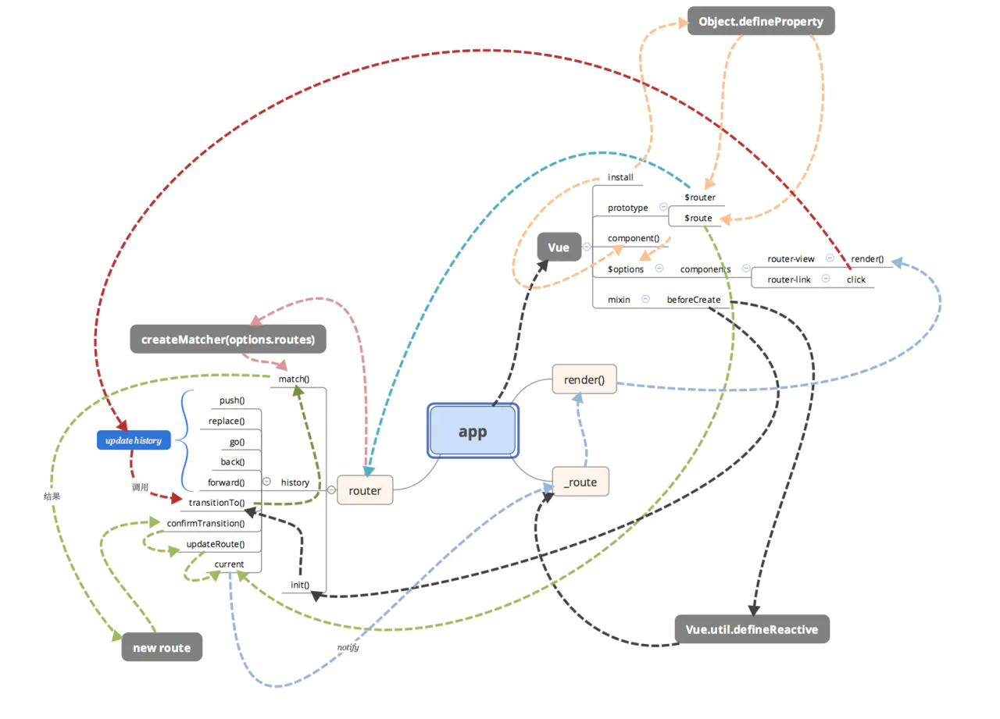
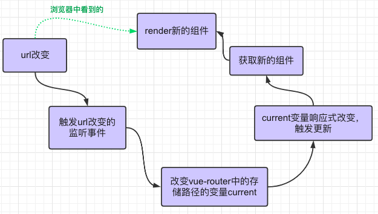

# vue-router

## 前言
### 后端路由
路由的概念起源于后端  

后端的路由大致流程  
1. 输入url  
2. 请求发送到服务器  
3. 服务器解析请求路径  
4. 服务器根据路由配置，拿到对应的数据或者页面  
5. 返回数据  


### 前端路由
>随着`ajax`的流行，异步数据请求交互运行在不刷新浏览器的情况下进行。而异步交互体验的更高级版本就是`SPA`—— 单页应用。单页应用不仅仅是在页面交互是无刷新的，连页面跳转都是无刷新的，为了实现单页应用，所以就有了前端路由

前端路由的大致流程  
1. 输入url  
2. js解析地址  
3. 找到对应的页面  
4. 执行该页面的js  
5. 浏览器渲染页面  

#### hash
在2014之前，大家使用`hash`来实现改变`url`的情况下，页面的不刷新，`hash`就是类似于  
```shell
http://www.xxx.com/#/login
```

- 从`#`开始就是`hash`的内容
- 通过`location.hash`拿到当前`hash`内容
- `onhashchange`监听`hash`改变


#### history
14年后，`HTML5`发布两个新`API`，`pushState`、`replaceState`，来实现改变`url`且不会发送请求。`HTML5` 的实现使`url`就不会多出一个`#`，从而变得更加美观；尽管和`hash`的实现方法类似，但是只要刷新页面，`history`就会真实去请求服务器，所以需要后端服务器的支持来解决这一问题

- 没有`#`，正常的路径，`www.[xxx].com/sadf/sadf`
- `location.pathname`到当前`history`地址
- `onpopstate`监听`history`改变

## vue-router 原理

### vue-router 其实是vue插件

在`vue`项目中  
```js
// router.js
import Router from 'vue-router'

Vue.use(Router)

export default new Router({
  routes: [
    {
      path: '/',
      name: 'home',
      component: () => import('../views/Home.vue')
    },
    // ...
  ]
}
```
`Vue.use()`是一个`vue`的一个安装插件的`api`，所以`vue-router`其实是一个`vue`的插件；  
最后看到`export`的是一个`router`实例，所以，`vue-router`也是一个`class`  
[关于更多vue插件](https://cn.vuejs.org/v2/guide/plugins.html)  

#### `vue`插件使用:  
关于插件这里总结一下：  
```js
Vue.use(plugin)
```
该方法执行`plugin.install`方法  
- `plugin`可以是一个方法，也可以是个对象  
- `plugin`是方法，直接执行`plugin`  
- `plugin`是对象，必须拥有`plugin.install`方法  
- 执行优先级`plugin.install` > `plugin`方法  

```js
// plugin.install方法:  
plugin.install = function (vue) {
  // 参数vue为vue构造类
  // 相当于import Vue from 'vue' 中的 Vue
}
```

### vue-router 结构
`vue-router`的整体主要结构如下  


从结构图中窥知一二

#### init
`vue-router`在`init()`里使用了`Vue.mixin()`，并在`beforeCreate`钩子里使用`Vue.util.defineReactive()`将变量`_route`变为响应式，这样当`_route`改变时，就会触发`render`函数重新渲染组件  
同时需要注册一个`router-view`组件来显示`render`渲染后的组件

`init()`同时还将`routes`路由数组编成了一个`map`，用来方便匹配路由的变化，从而快速找到对应组件

#### history & match
`history`是另一个对象，包含了`current`变量，用来存储当前的路由信息，并且`_route`变量就是指向它；  
同时在`history`内部，包含了`push`、`go`、`replace`、`back`、`forward`等方法，用来改变`history`对象；  
当`history`对象发生更新的时候，会触发`match()`函数，来匹配当前路由对应的组件

### vue-router 流程
`vue-router`的简化流程如下  
  

## 自实现vue-router
动手自实现`vue-router`加深对其的理解  
在项目目录新建`src/routes/index.js`、`src/routes/my-router.js`，并新建一个分页组件`src/views/Test.vue`
```shell
src
 ├── App.vue
 ├── assets
 ├── main.js
 ├── routes
 │    ├── index.js
 │    └── my-router.js
 └── views
      ├── Home.vue
      └── Test.vue
```

在`src/routes/index.js`引入`my-router`，并将`test`页面登记进`routes`数组里
```js
// src/routes/index.js
import Vue from 'vue'
import Router from './my_router'

Vue.use(Router)

export default new Router({
  routes: [
    {
      path: '/',
      name: 'home',
      component: () => import('../views/Home.vue')
    },
    {
      path: '/test',
      name: 'test',
      component: () => import('../views/Test.vue')
    },
  ]
})
```
为`test.vue`页面添加一点内容
```html
<!-- src/views/Test.vue -->
<template>
  <div class="tst">
    <h1>This is my route tst page</h1>
  </div>
</template>
```

### 创造history对象
```js
// src/routes/my-router.js
/* 
  历史记录对象
  @class History
  this.current保存当前路由信息
*/
class HistoryRoutes {
  constructor() {
    this.current = null;
  }
}
```

### 初始化
写一个`MyRouter`的类  
并添加`init()`，我们用简易的方法，为其绑定`route`的监听  
在创建一个`createMap`，用来更方便的保存路径和组件的对应关系
```js
/* 
  @class MyRouter
  @param
    options 设置路由参数的对象
*/
class MyRouter {
  constructor(options) {
    // 新建历记录实例
    this.history = new HistoryRoutes()
    // 历史记录模式，hash / history，默认hash
    this.mode = options.mode || 'hash'
    // 路由路径
    this.routes = options.routes || []
    // 生成路由地图
    this.routesMap = this.createMap(this.routes)
  }

  /* 
    @function 初始化
    绑定route的监听 
  */
  init() {
    // hash 模式下的监听
    if (this.mode === 'hash') {
      // 若当前路径哈希不存在，自动加上哈希
      location.hash ? '' : location.hash = '/'
      // 绑定监听事件
      // 初始加载
      // 绑定初始的hash
      window.addEventListener('load', () => {
        // location.hash返回的是‘#/xxx’，需要去除第一位的#
        this.history.current = location.hash.slice(1)
      })
      // 哈希改变
      window.addEventListener('hashchange', () => {
        this.history.current = location.hash.slice(1)
      })
      // history 模式下的监听
    } else {
      location.pathname ? '' : location.pathname = '/'
      window.addEventListener('load', () => {
        this.history.current = location.pathname
      })
      window.addEventListener('popstate', () => {
        this.history.current = location.pathname
      })
    }
  }

  /* 
    @function 生成路由地图
    @param routes的一个数组
    @return 一个map对象
    {
      '/route': component
    }
  */
  createMap(routes) {
    return routes.reduce((acc, val) => {
      acc[val.path] = val.component
      return acc
    }, {})
  }
}

export default MyRouter
```

### install
将该组件注册成插件，注入`vue`app
`install`里面需要做两件事，第一件是混入(`mixin`)`router`实例，第二件是注册`router-view`组件
```js
// @function install
MyRouter.install = function (vue) {

  // 混入
  vue.mixin({
    // 查找到根实例组件 绑定当前组件和根实例router对象
    beforeCreate() {
      // 路由根实例
      // 只有vue.$options中存在router的才是router的根实例
      if (this.$options && this.$options.router) {
        this._routerRoot = this
        this._router = this.$options.router
        // 初始化router
        this._router.init()
        // 用vue内置方法将组件的_route变量变为响应式，其值指向_router.history.current
        vue.util.defineReactive(this, '_route', this._router.history.current)
      } else {
        // 路由根实例的子实例 或者 其他根实例（路由根实例的上层实例）
        this._routerRoot = (this.$parent && this.$parent._routerRoot) || this
      }
    }
  })

  // 注册router-view组件
  vue.component('router-view', {
    // vue渲染函数
    render(h) {
      // 拿到当前路径
      let current = this._self._routerRoot._router.history.current
      let routesMap = this._self._routerRoot._router.routesMap
      // 渲染当前组件
      return h(routesMap[current])
    }
  })
}
```


## 参考
[vue-router源码分析-整体流程](https://juejin.im/post/584040e1ac502e006cbedb23)  
[解密vue-router: 从源码开始](https://juejin.im/post/5af108dc518825672565cf31)  
[带你全面分析vue-router源码（万字长文）](https://juejin.im/post/5e456513f265da573c0c6d4b)  
