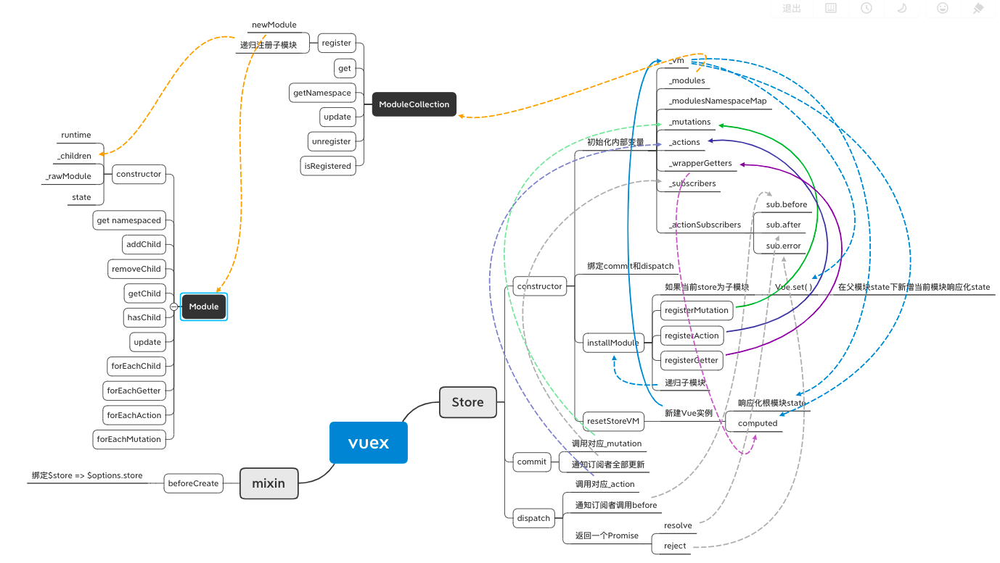

# vuex 原理解析
先看下`vuex`大致用法
```js
// store.js
import Vue from 'vue'
import Vuex from 'vuex'
Vue.use(Vuex)  // 运行vuex.install()

// 创建store实例，并写入options，开放该接口供vue实例来使用
export default new Vuex.Store({  
  state: { ... },
  mutations: { ... },
  actions: { ... }
})

// main.js
import store from './store.js'  // 引入上述store实例接口

new Vue({
  store
})
```

可以看出和`vue-router`一样，`vuex`也是`Vue`的一个插件

## 原理



## install
`install`主要做了两件事
- 为`store`全局绑定了一个`vue`实例
- 向所有`vue`实例组件混入
  - `beforeCreate`
    - Vue根实例：`$store` => `$options.store`
    - 子组件：`$store` => `$options.parent.$store`（*父组件的`$store`在指向父组件一直到根组件的`$store`*）

```js
// myStore.js
let Vue // store全局的Vue实例

export function install(_Vue){
  // 全局Vue => 当前Vue实例
  Vue = _Vue
  
  // 混入
  vue.mixin({
    beforeCreated() {
      // 找出vue根实例（只有根实例才有store属性）
      if (this.$options && this.$options.store) {
        // this.$store => vue根实例中引入的store实例
        this.$store = this.$options.store
      } else if (this.$options.parent && this.$options.parent.$store) { //其他子组件
        // this.$store => 当前组件父组件的$tore（父组件再指向父组件一直指到根实例）
        this.$store = this.$options.parent.$store
      }
    }
  })
}
```

## Store
`Store`就是一个类
- 初始化内部变量
- 绑定`commit`和`dispatch`
- `installModule`：注册`store`模块（递归根模块）
- `resetStoreVM`：重置`store`的`vm`

```js
export class Store{
  constructor(options = {}){
    // ...
  }
}
```

### state
`store`的`state`也是响应式的，实现核心就是创建了一个新的`Vue`实例，将`state`挂载到这个`Vue`实例的`data`上，使其成为响应式，并将`store._vm`指向这个`Vue`实例

```js
store._vm = new Vue({
  data: {
    $$state: state
  },
  computed
})
```

>源码中`state`的响应式是在`constructor`中的`resetStoreVM`方法里内实现

>[源码](https://github.com/vuejs/vuex/blob/dev/src/store.js#L281)

#### get & set
在`Store`内部设置了`get`和`set`方法，设定了`state`的访问和修改

```js
get state() {
  return this._vm._data.$$state
}

set state(v) {
  if (__DEV__) {
    assert(false, `use store.replaceState() to explicit replace store state.`)
  }
}
```

>`get`方法直接返回了`vue`实例`this._vm`的响应式`data`中对应的数据值  
>`set`方法不允许直接修改`Store`里的`state`


#### 模块的`state`
因为`vuex`还会分模块，所以之前的`state`响应式是针对`store`根模块的`state`，如果是子模块，在`installModule`方法中，采用了将子模块的`state`通过`Vue.set()`方法添加进响应式中

```js
// @function installModule
// ...
// 非根模块
if (!isRoot) {
  const parentState = getNestedState(rootState, path.slice(0, -1))
  const moduleName = path[path.length - 1]
  // 将parentState转化为响应式
  Vue.set(parentState, moduleName, module.state)
}
// ...
```

>先取得父`state`，再取得当前模块名称，最后使用`Vue.set()`将当前的`state`设置在父`state`下

>[源码](https://github.com/vuejs/vuex/blob/dev/src/store.js#L355)

### mutations
实际上就是收集用户传入的`mutations`，并将原来的`mutations`方法包装一层（增加了`payload`参数）再放入初始化的`_mutations`对象中

```js
function registerMutation (store, type, handler, local) {
  const entry = store._mutations[type] || (store._mutations[type] = [])
  // 推入包装后的函数，参数新增payload
  entry.push(function wrappedMutationHandler (payload) {
    handler.call(store, local.state, payload)
  })
}
```

>之所以`entry`用数组是为了收集未使用`namespaced`的不同模块所有同名`mutation`方法；如果模块之间没有使用`namespace: true`，那么调用一个同名`muatation`会将该属组内所有的同名`mutation`全部触发

>源码中`registerMutation`是在`installModule`方法中调用的：[源码](https://github.com/vuejs/vuex/blob/7cb99525765d63e49a8dba7a083064806d54a230/src/store.js#L464)

#### commit
`commit`是用来调用`mutation`的，其实现原理就是从收集`_mutaitons`中找到用户传入的`type`（mutationName）对应的数组方法，然后遍历执行，并通知订阅者

```js
commit (type, payload, options) {
  const mutation = { type, payload }
  const entry = this._mutations[type]
  // 遍历执行
  entry.forEach(function commitIterator (handler) {
    handler(payload)
  })

  // 通知订阅者全部更新
  this._subscribers
    .slice() // shallow copy to prevent iterator invalidation if subscriber synchronously calls unsubscribe
    .forEach(sub => sub(mutation, this.state))
}
```

### actions
`actions`和`mutations`一样，也是收集后包装一层（增加了`payload`参数）再放入初始化的`_actions`对象中

```js
function registerAction (store, type, handler, local) {
  const entry = store._actions[type] || (store._actions[type] = [])
  // 推入包装函数，定义了参数里的{commit, ... }对象
  entry.push(function wrappedActionHandler (payload) {
    // 将函数执行结果返回给res
    let res = handler.call(store, {
      dispatch: local.dispatch,
      commit: local.commit,
      getters: local.getters,
      state: local.state,
      rootGetters: store.getters,
      rootState: store.state
    }, payload)
  })

  // 判断res是否有then
  if (!isPromise(res)) {
    res = Promise.resolve(res)
  }
}
```
>`registerAction`和`registerMutation`类似，但是多了一步将函数执行结果返回给`res`再进行异步判断；`isPromise()`函数主要判断`res`是否是异步函数（有没有`then`方法），如果没有，则用`Promise.resolve()`包裹一下再返回，目的就是为了`res`下一步可以继续使用异步`then`方法

> 源码中`registerAction`同样是在`installModule`方法中调用：[源码](https://github.com/vuejs/vuex/blob/7cb99525765d63e49a8dba7a083064806d54a230/src/store.js#L471)


#### dispatch
`dispatch`调用`actions`，从收集`_actions`中找到用户传入的`type`（actionName）对应的数组方法，然后遍历执行；区别在于，执行结果并没有返回而是返回了一个`promise`包裹的结果
```js
dispatch(type, payload) {
  const action = { type, payload }
  const entry = this._actions[type]

  // 如果action有多个同名方法，使用promise.all判断所有action全部执行完毕，才返回结果
  // 如果action只有一个方法，直接返回结果
  const result = entry.length > 1
    ? Promise.all(entry.map(handler => handler(payload)))
    : entry[0](payload)

  // 返沪一个pormise，执行之前结果的then
  return new Promise((resolve, reject) => {
    result.then(res => {
      resolve(res)
    }, error => {
      reject(error)
    })
  })
}
```

### getters
`vuex`的`getters`其实就是`vue`实例中的`computed`属性

同样是先在`installModule`方法中，对`getters`进行了注册，但是和之前不同，并不是用数组接收同名函数，而是直接用`_wrapperedGetters`对象接收包装后的`getter`函数
```js
function registerGetter (store, type, rawGetter, local) {
  // 直接用对象接收
  store._wrappedGetters[type] = function wrappedGetter (store) {
    return rawGetter(
      local.state, // local state
      local.getters, // local getters
      store.state, // root state
      store.getters // root getters
    )
  }
}
```

将这些`wrapperedGetters`转变为`_vm`中的`computed`属性发生在`resetStoreVM`方法中

```js
function resetStoreVM (store, state, hot) {
  const oldVm = store._vm

  // bind store public getters
  store.getters = {}
  // reset local getters cache
  store._makeLocalGettersCache = Object.create(null)
  const wrappedGetters = store._wrappedGetters
  const computed = {}
  forEachValue(wrappedGetters, (fn, key) => {
    // 使用computed利用其懒加载机制
    // 直接使用内联函数将导致闭包保留oldVm
    // 使用partial返回函数，只保留闭包环境中的参数
    computed[key] = partial(fn, store)
    Object.defineProperty(store.getters, key, {
      get: () => store._vm[key],
      enumerable: true // for local getters
    })
  })

  /* 
    使用一个vue实例来存储store的所有state
    并将所有的getters都放在computed里
  */
  const silent = Vue.config.silent
  Vue.config.silent = true
  store._vm = new Vue({
    data: {
      $$state: state
    },
    computed
  })
  Vue.config.silent = silent
}
```
>遍历之前的`wrapperedGetters`，将所有`getters`函数包一层函数后给到`computed`对象，然后`computed`和`state`一起放入了`this._vm`的`vue`实例当中，设置`Object.defineProperty`拦截，一旦需要获取某个`getter`函数，直接返回`_vm`中的`computed`同名属性

>[源码](https://github.com/vuejs/vuex/blob/7cb99525765d63e49a8dba7a083064806d54a230/src/store.js#L281)


### module
`vuex`加入模块化后，所有不同模块的`state`、`mutation`、`action`、`getter`都属于各自的模块的，而不是直接暴露在一个`store`根模块下

在`constructor`初始化内部变量时，新建一个模块集合，将用户传入的`options`中的所涉及的所有模块进行注册

```js
class Store{
  constructor(options = {}){
    // ...
    // 模块集合
    this._modules = new ModuleCollection(options)
    // ...
  }
}
```

#### ModuleCollection
`ModuleCollection`很简单，就是用来注册（初始化）用户传进来的原始模块
```js
export default class ModuleCollection {
  // @params rawRootModule - 原始根模块
  constructor (rawRootModule) {
    // 注册vuex模块
    // register root module (Vuex.Store options)
    this.register([], rawRootModule, false)
  }
}
```

看到`ModuleCollection`中的`register`函数
```js
register (path, rawModule, runtime = true) {

  const newModule = new Module(rawModule, runtime)
  if (path.length === 0) {
    // 根模块
    this.root = newModule
  } else {
    // 子模块 path: [foo, bar, a, b]
    // 子模块 => module b
    const parent = this.get(path.slice(0, -1))  // parent => module a
    parent.addChild(path[path.length - 1], newModule)
  }

  // 注册嵌套模块
  if (rawModule.modules) {
    forEachValue(rawModule.modules, (rawChildModule, key) => {
      this.register(path.concat(key), rawChildModule, runtime)
    })
  }
}
```

>`register`函数对原始模块进行递归注册每层模块，使之成为`Module`实例，然后将`this.root`指向根模块，层层嵌套子模块

>[ModuleCollection源码](https://github.com/vuejs/vuex/blob/7cb99525765d63e49a8dba7a083064806d54a230/src/module/module-collection.js#L4)

#### Module
`Module`构造函数也颇为简单，就是将一个模块转化为`Module`实例
```js
export default class Module {
  constructor (rawModule, runtime) {
    this.runtime = runtime
    this._children = Object.create(null)
    this._rawModule = rawModule
  }

  addChild (key, module) {
    this._children[key] = module
  }

  getChild (key) {
    return this._children[key]
  }
  // ...
  forEachChild (fn) {
    forEachValue(this._children, fn)
  }

  forEachGetter (fn) {
    if (this._rawModule.getters) {
      forEachValue(this._rawModule.getters, fn)
    }
  }

  forEachAction (fn) {
    if (this._rawModule.actions) {
      forEachValue(this._rawModule.actions, fn)
    }
  }

  forEachMutation (fn) {
    if (this._rawModule.mutations) {
      forEachValue(this._rawModule.mutations, fn)
    }
  }
}
```

>`_children`存储子模块，`_rawModule`存储原始模块数据，并用`addChild`、`getChild`等方法来添加获取子模块，还添加了一些遍历方法可以循环该模块内部的`child`、`getter`、`mutation`、`action`等

>[Module源码](https://github.com/vuejs/vuex/blob/7cb99525765d63e49a8dba7a083064806d54a230/src/module/module.js)

#### installModule
模块全部初始化完成后，就该安装（注册）模块了，回到`store`的`installModule`函数，这也是`Store`构造里比较关键的一个函数，因为之前提到的`state（非根模块）`、`getter`、`mutation`、`action`都是在这里按模块进行层层注册的

```js
function installModule (store, rootState, path, module, hot) {
  const isRoot = !path.length
  const namespace = store._modules.getNamespace(path)

  // 在模块映射图里注册该模块
  if (module.namespaced) {
    store._modulesNamespaceMap[namespace] = module
  }

  // set state
  // 非根模块设置state响应式
  if (!isRoot && !hot) {
    const parentState = getNestedState(rootState, path.slice(0, -1))
    const moduleName = path[path.length - 1]
    store._withCommit(() => {
      // 将parentState转化为响应式
      Vue.set(parentState, moduleName, module.state)
    })
  }

  const local = module.context = makeLocalContext(store, namespace, path)

  // mutaion注册
  module.forEachMutation((mutation, key) => {
    const namespacedType = namespace + key
    registerMutation(store, namespacedType, mutation, local)
  })

  // action注册
  module.forEachAction((action, key) => {
    const type = action.root ? key : namespace + key
    const handler = action.handler || action
    registerAction(store, type, handler, local)
  })

  // getter注册
  module.forEachGetter((getter, key) => {
    const namespacedType = namespace + key
    registerGetter(store, namespacedType, getter, local)
  })

  // 递归注册子模块
  module.forEachChild((child, key) => {
    installModule(store, rootState, path.concat(key), child, hot)
  })
}
```

>因为是要按照不同模块进行属性注册的，所以`namespace`就是发挥了这个区别模块的作用；`store._modules.getNamespace(path)`返回了一个由`path`数组拼接而来的字符串，比如：

```js
// path: []
=> namespace: /

// path: [a]
=> namespace: /a/

// path: [a, b]
=> namespace: /a/b/
```
>这样即使不同模块的由同名属性函数，也可以进行区别注册，因为`namespace`不同，`namespacedType`自然也不同

### map函数

[mapState参考](https://juejin.im/post/6844903599764406286)

## 参考
[已注释源码](./srcCode/store.js)