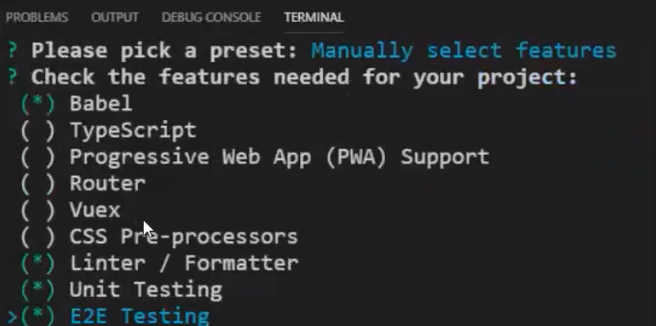
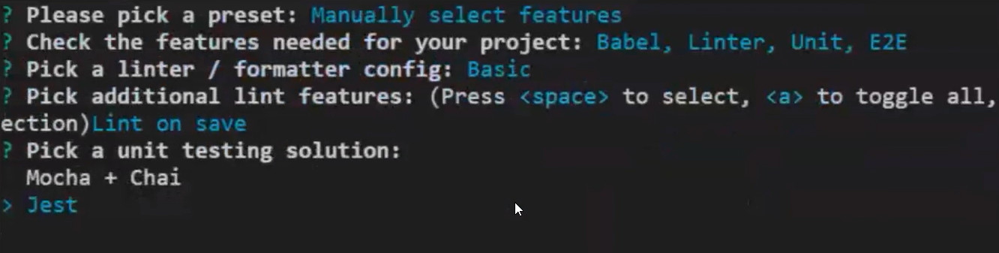
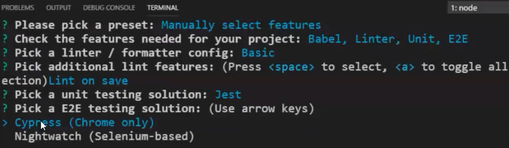
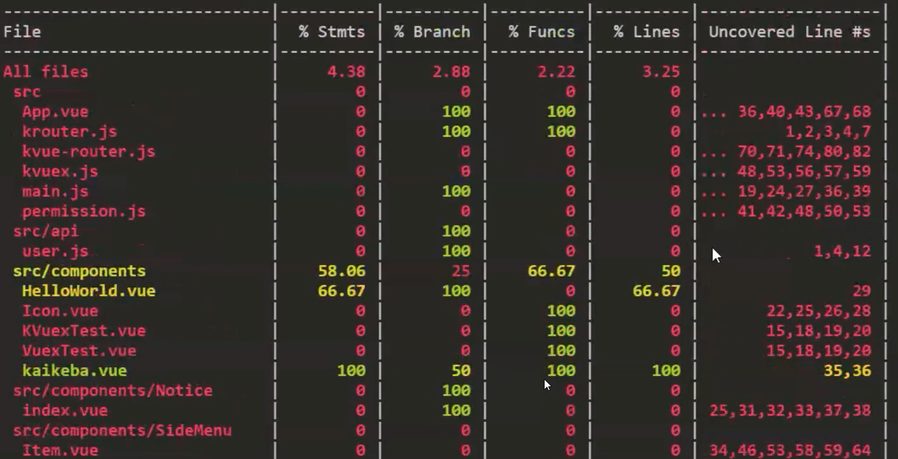

# 测试
- **黑盒测试**：不管内部实现机制，只看最外层的输入输出
- **白盒测试**：不管内部实现机制，只看最外层的输入输出
- **E2E测试**：根据测试用例在页面上测试业务逻辑的正确性
- **集成测试**：集合多个测试单元一起测试
- **单元测试**：针对一些内部核心实现逻辑编写测试

## 准备工作
要完成测试，需要测试框架（跑测试）、断言库（编写测试）和编程框架特有的编程套件 

在`vue`中，推荐使用`Mocha`+`Chai`或者`Jest`
>`mocha`（测试框架），`chai`（断言库）、`jest`（测试框架+断言库）

>`vue`的组件等测试代码编写的时候需要用到`vue-test-utils`套件支持

### 新建项目
- 选择`Unit Testing`和`E2E Testing`


- 单元测试解决方案选择`jest`


- 端到端的测试解决方案选择`Cypress`


### 已有项目
```shell
# 单元测试
vue add @vue/unit-jest
# e2e 端到端测试
vue add @vue/e2e-cypress
```

安装完成后会出现`./tests`目录   
所有单元测试的文件都写在`./test/unit/`目录中
```shell
.
├── tests   # 测试目录
│   └── unit  # 单元测试目录
└── jest.config.js  # jest配置文件
```

## 单元测试
新建`./test/unit/example.spec.js`
>`*.spec.js`是命名规范

```js
import { shallowMount } from '@vue/test-utils'
import HelloWorld from '@/components/HelloWorld.vue'

// 测试套件 test suit
describe('HelloWorld.vue', () => {
  // it 测试用例 test case
  it('renders props.msg when passed', () => {
    const msg = 'new message'
    const wrapper = shallowMount(HelloWorld, {
      propsData: { msg }
    })
    // 断言 assert
    expect(wrapper.text()).toMatch(msg)
  })

  // 其他测试用例
  // it()
  // ...
})
```

>断言`api`简介
>- `describe`：定一个测试套件
>- `it`：定义一个测试用例
>- `expct`：断言的判断条件
>- 更多[api](https://jestjs.io/docs/zh-Hans/api)

### 执行测试
```shell
npm run test:unit
```

### 组件测试
新建一个案例组件`./components/tst.vue`
```vue
 <template>
  <div>
    <span>{{ message }}</span>
    <button @click="changeMsg">点击</button>
  </div>
</template>

<script>
export default {
  data() {
    return {
      message: "vue-text",
    };
  },
  created() {
    this.message = "tst";
  },
  methods: {
    changeMsg() {
      this.message = "按钮点击";
    },
  },
};
</script>
```

编写组件测试文件`./tests/tst.spec.js`
- 普通弱智写法 
```js
// 导⼊ Vue.js 和组件，进⾏行测试
import Vue from 'vue'
import Tst from '@/components/tst.vue'

describe('Tst', () => {
  // 检查原始组件选项 
  it('由created⽣生命周期', () => {
    expect(typeof Ts t.created).toBe('function')
  })

  // 评估原始组件选项中的函数的结果 
  it('初始data是vue-text', () => {
    // 检查data函数存在性
    expect(typeof Tst.data).toBe('function') // 检查data返回的默认值
    const defaultData = Tst.data()
    expect(defaultData.message).toBe('hello!')
  })

  // 检查mounted
  it('mount之后测data是tst', () => {
    const vm = new Vue(Tst).$mount()
    expect(vm.message).toBe('tst')
  })
})
```

- 稍微高级点的写法
Vue官⽅也提供了一个单元测试实用工具库[Vue Test Utils](https://vue-test-utils.vuejs.org/zh/)

```shell
npm i -D @vue/test-utils
```

这样写测试代码相比与上面更简单
```js
import Tst from '@/components/tst.vue'
import { mount } from '@vue/test-utils'

describe('Tst', () => {
  // 检查用户点击
  it("按钮点击后", () => {
    const wrapper = mount(Tst); 
    wrapper.find("button").trigger("click");
    // 测试数据变化
    expect(wrapper.vm.message).toBe("按钮点击");
    // 测试html渲染结果 
    expect(wrapper.find("span").html()).toBe("<span>按钮点击</span>");
    // 等效的方式
    expect(wrapper.find("span").text()).toBe("按钮点击");
  });
}
```

### 测试覆盖率
`jest`自带测试覆盖率，修改`jest.config.js`
```js
// jest.config.js
module.exports = {
  "collectCoverage": true,
  "collectCoverageFrom": ["src/**/*.{js, vue}"]
}
```

>也可以修改`package.json`
```js
"jest": {
  "collectCoverage": true,
  "collectCoverageFrom": ["src/**/*.{js, vue}"]
}
```
执行测试，我们可以看到最后打印出了一个覆盖率的表格



>- `%stmts`，语句覆盖率(statement coverage)：每个语句都是否执⾏
>- `%Branch`，分⽀覆盖率(branch coverage)：每个`if`代码块都是否执⾏ 
>- `%Funcs`，函数覆盖率(function coverage)：每个函数都是否调⽤ 
>- `%Lines`，⾏覆盖率(line coverage)：每行都是否执⾏

## E2E测试
借用浏览器，从用户角度，完全模拟用户，和具体框架关系不大，完全模拟浏览器行为

### 运行测试
```shell
npm run test:e2e
```

### 编写e2e测试文件
```js
describe('e2e test', () => {
  it('visit app', () => {
    cy.visit('/')
    cy.contains('span', 'Welcome to your Vue.js App')
    // ...
    // 模拟点击
    cy.get('button').click()
    cy.contains('span', '按钮点击')
  })
})
```

>[官方api文档](https://docs.cypress.io/api/introduction/api.html)
