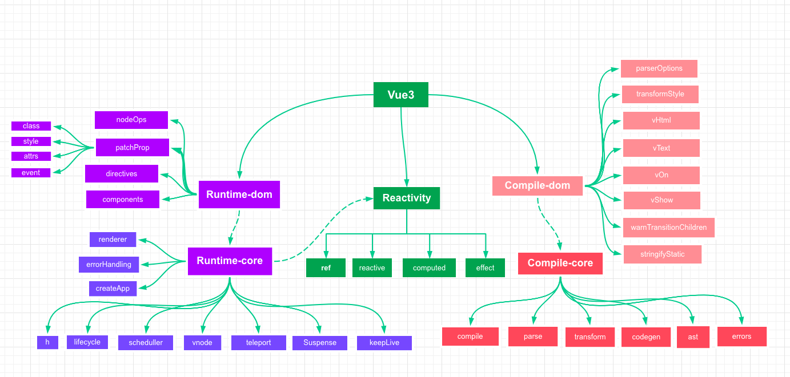
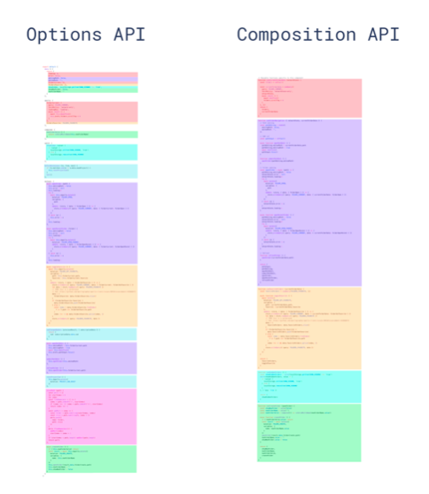

## 体验 Vue3
目前有三种方式可以体验到Vue3：
- `vue-cli`脚手架创建项目，项目内添加`vue-next`包
```shell
vue create vue3-experirence #项目名
vue add vue next
```
- 直接`clone`github上的项目`vue-next-webpack-preview`
```shell
git clone git@github.com:vuejs/vue-next-webpack-preview.git
```
- `vue-vite`工具
```shell
sudo npm install -g create-vite-app
create-vite-app vue3-experirence #项目名
```

三者主要代码几乎一致
但是`vue-vite`是下一代开放工具，非常厉害，推荐体验


vue3的整体主要分成五大块
- reactivity
- runtime-dom
- runtime-core  渲染在多平台上
- compile-dom
- compile-core



### Composition API
- `Vue3`使用`Composition API`代替原来`Vue2`的`Option API`；
同时兼容了`Vue2`中`Option API`的写法

- 生命周期中用`setup`函数用来替代原来的`beforeCreated`和`created`函数；
...

- 最初使用`import`引入接口，目的是为了减小文件体积，如果有`api函数`没有引入，那么最后打包就不会打包进去

- 新增`ref`、`reactive`、`toRefs`、`computed`几个api函数对应原来的`data`、`computed`数据接口
  - `ref`：处理普通数据类型，将其变为响应式数据
  - `reactive`：一般用来处理引用类型数据，将其变为响应式
  - `toRefs`：包裹上述数据输出，用来美观数据的引用，例如：
  `const state = reactive(data: [1, 2, 3])`； `return { state }`
  若想要在`template`中引用就必须`{{state.data}}`；
  若`return { ... toRefs(state)}`，则引用变为`{{data}}`

- 原来`methods`里的`function`在`Vue3`中本来就可以拆分出去，只要最后`return`对应的`function`即可；
这样可以拆分出函数，独立在别的文件中；
`Vue2`只能通过`mixin`来实现，但这样可能会造成源头混乱以及重命名问题；

如下图，不同颜色为不同功能对应的代码块，`composition api`一目了然，非常清晰


下面开始体验`Vue3`的新api，实现一个简单的`to-do-app`：

```html
<template>
  <div id="app">
    <input type="text" v-model="newTodo" @keyup.enter='addTodo'>
    <li @click="toggle(i)" v-for="(todo, i) in todos" :key="i">{{todo.title}}</li>
    <p>remaining: {{remaining}}</p>
  </div>
</template>
```

```js
// script
// import api
import { ref, reactive, toRefs, computed } from "vue";
export default {
  setup() {
    const state = reactive({
      newTodo: '',
      todos: [
        { id: "1", title: "eat", completed: false },
        { id: "2", title: "drink", completed: false },
        { id: "3", title: "sleep", completed: false }
      ]
    });
    // 函数是可以拆分出去
    function addTodo(){
      state.todos.push({
        id: Math.random(),
        title: state.newTodo,
        completed: false
      })
      state.newTodo = '';
    }
    const remaining = computed(
      () => state.todos.filter(todo => !todo.completed).length
    )
    function toggle(i){
      state.todos[i].completed = !state.todos[i].completed;
    }
    return { ref, ...toRefs(state), addTodo, remaining, toggle };
  }
};
```
如果有api函数没有import，在打包时就不会被打包进去，这就是<a href="#treeshaking">tree-shaking</a>

```css
/* style */
li.done{
  text-decoration: line-through;
}
```

#### 拆分简单逻辑
上述栗子中将`addTodo`函数拆分出去独立：
新建`addTodo.js`文件
```shell
src
 ├── App.vue
 ├── addTodo.js #新建
...
```
```js
// addTodo.js
export default function (state) {
  function addTodo() {
    state.todos.push({
      id: Math.random(),
      title: state.newTodo,
      completed: false
    })
    state.newTodo = '';
  }
  return { addTodo }
}
```
```js
// app.vue
// addTodoFunc 对应 js文件中的export的default
import addTodoFunc from "./addTodo.js";
export default {
  setup(){
    // ...
    // addTodofunc(state)对应js文件中 外层function返回的对象{addTodo}
    const { addTodo } = addTodoFunc(state);
    // ...
    return { ref, ...toRefs(state), addTodo, remaining, toggle };
  }
}
```
`npm run serve`发现与原来的功能无异，但是逻辑上把`addTodo`这个功能拆分出来

#### 拆分复杂逻辑
`Vue3`厉害的是，当把功能拆分出去后，无论这个功能内部逻辑有多复杂，都是可以直接独立存在并且可以发布到npm上的；
下面看一个简单的🌰

要求：
当列表向下滑动时，划过某一行开始，使得输入框始终保持在页面最顶端

逻辑：
拆分出得功能组件`useScroll`返回一个响应式高度变量`top`，然后在主页上判断`top`大于某`300px`，就该改变`input`的`class`

实现：
新建`useScroll.js`文件
```shell
src
 ├── App.vue
 ├── addTodo.js
 ├── useScroll.js #新建
...
```

```js
// useScroll.js
import { ref, onMounted, onUnmounted } from 'vue';

// 返回滚动高度
export default function useScroll() {
  // 将变量top转为响应式
  const top = ref(0);
  // 更新当前页面滑动高度
  function update() {
    top.value = window.scrollY;
  }

  // 生命周期
  onMounted(() => {
    // 加入滚动事件监听
    window.addEventListener('scroll', update)
  })
  
  onUnmounted(() => {
    // 解绑滚动事件监听
    window.removeEventListener('scroll', update)
  })

  // 返回高度变量top
  return { top }
}
```

在原来`app.vue`的数据中新增一些列表数据，并修改`css`，使之足够高可以让页面滑动，并对`input`进行`class`绑定
```html
<template>
  <input :class="{fixeditem: top > 300}" type="text" v-model="newTodo" @keyup.enter="addTodo" />
</template>
```
```js
// script
export default {
  setup(){
    const state = reactive({
      // ...
      todos: [
        { id: "1", title: "eat", completed: false },
        { id: "2", title: "drink", completed: false },
        { id: "3", title: "sleep", completed: false },
        { id: "4", title: "read", completed: false },
        { id: "5", title: "walk", completed: false },
        { id: "6", title: "jogging", completed: false },
        { id: "7", title: "shoping", completed: false },
        { id: "8", title: "cook", completed: false },
        { id: "9", title: "shower", completed: false }
      ]
      // ...
    });
  }
}
```
```css
/* style */
li{
  height: 200px;
}
input.fixeditem{
  position: fixed;
  top: 0;
  left: 0;
}
```
引入`useScroll`功能组件
```js
// script
import useScroll from './useScroll.js'
export default {
  setup(){
    // ...
    const { top } = useScroll();
    // ...
    return { top }
  }
}
```

这样这个功能组件就完成了，非常丝滑，逻辑上也是独立存在的；
在`app.vue`中，任何数据变量来源在代码上体现都非常清晰，这点是原来`mixin`做不到的；

#### 附录
##### tree shaking
<a name="treeshaking"></a>
>*tree shaking*是一个术语，通常用于描述移除 JavaScript 上下文中的未引用代码(dead-code)。它依赖于 ES2015 模块系统中的静态结构特性，例如 import 和 export。这个术语和概念实际上是兴起于 ES2015 模块打包工具 rollup。
[详情](https://www.webpackjs.com/guides/tree-shaking/)


