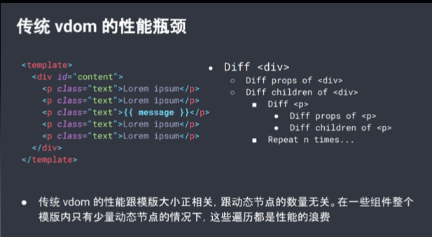
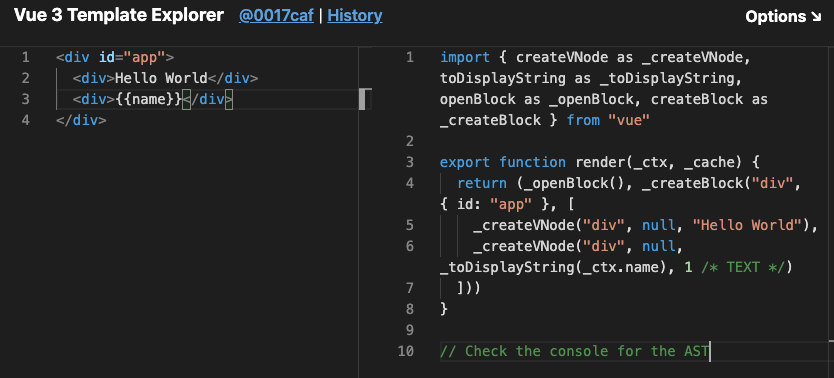
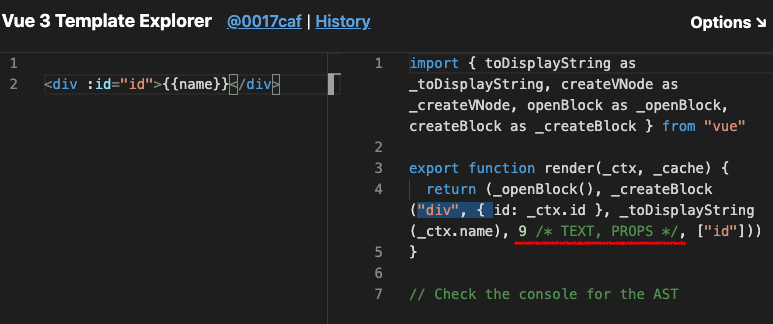
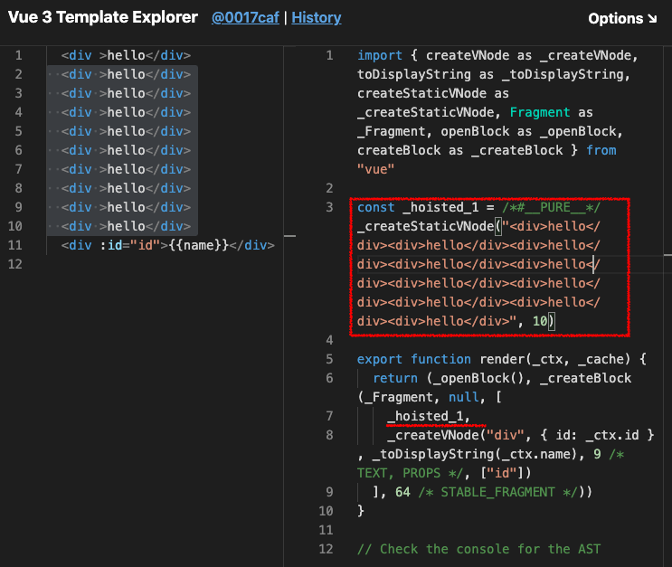
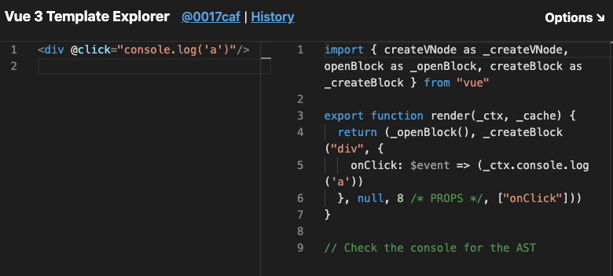
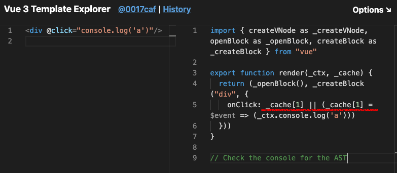

# Vue2 vs Vue3

## Vue3 vnode & diff 优化
`vue3`的`compile`将`template`转换成`render`函数，包含`vnode`生成函数

具体参考[Vue3编译](../Vue3编译/README.md)

`vue3`的渲染提升了很多，`upadte`性能提升`1.3~2`倍，`ssr`提升`2~3`倍

### vnode
参考[Vue3编译](../Vue3编译/README.md)

`vdom`就是用一个`js对象`去描述`node节点`的一个抽象语法树


```js
let vdom = {
  type: "div",  // 标签类型
  props: {id: "app"}, // 标签属性
  children: ["hello"] // 标签子内容
}
```
`vdom`优势：
在更新的时候，只需要将旧的`vnode`和更新后的`vnode`做一个`diff`运算（对比），找出最小的修改部分，最后重新渲染该部分即可大大**提高更新速度和节省性能开支**

[vnode源码](https://github.com/vuejs/vue-next/blob/cf2f278f48e21ff8e2a325c09eb0c7ab5bf5a1f4/packages/runtime-core/src/vnode.ts#L291)

`vue3`对于`vnode`的更新
- **动态标记**：在创建时区分静态与动态，静态不会被`diff`
- **节点类型分类**：标记动态节点的动态属性类型，`diff`不用遍历全部属性
- **事件缓存**

#### 静态标记
在`vue2`的时候已经存在静态标记了，但是仍然会存在浪费性能的情况，因为在`diff`的时候，它会遍历整个`vnode`



而`vue3`则是在创建`vnode`的时候，就把动态节点标记出来，这样在`diff`过程中只需要比较标记出来的节点即可，而无需再把其他静态节点遍历一遍

参考在线`vue3`的`compile`出来的`render`函数[vue3 template explorer](https://vue-next-template-explorer.netlify.app/#%7B%22src%22%3A%22%3Cdiv%20id%3D%5C%22app%5C%22%3E%5Cn%20%20%3Cdiv%3EHello%20World%3C%2Fdiv%3E%5Cn%20%20%3Cdiv%3E%7B%7Bname%7D%7D%3C%2Fdiv%3E%5Cn%3C%2Fdiv%3E%22%2C%22ssr%22%3Afalse%2C%22options%22%3A%7B%22mode%22%3A%22module%22%2C%22prefixIdentifiers%22%3Afalse%2C%22optimizeBindings%22%3Afalse%2C%22hoistStatic%22%3Afalse%2C%22cacheHandlers%22%3Afalse%2C%22scopeId%22%3Anull%7D%7D)

它的`ast`:

看到在`ast`上存在`dynamicChildren`数组，这就是动态节点数组，而`vue2`中是没有的


#### 节点类型细分
[vue3 template explorer](https://vue-next-template-explorer.netlify.app/#%7B%22src%22%3A%22%3Cdiv%20id%3D%5C%22app%5C%22%3E%5Cn%20%20%3Cdiv%3EHello%20World%3C%2Fdiv%3E%5Cn%20%20%3Cdiv%3E%7B%7Bname%7D%7D%3C%2Fdiv%3E%5Cn%3C%2Fdiv%3E%22%2C%22ssr%22%3Afalse%2C%22options%22%3A%7B%22mode%22%3A%22module%22%2C%22prefixIdentifiers%22%3Afalse%2C%22optimizeBindings%22%3Afalse%2C%22hoistStatic%22%3Afalse%2C%22cacheHandlers%22%3Afalse%2C%22scopeId%22%3Anull%7D%7D)

`_createVNode`函数只有当第四个参数存在时，才会将其标记为动态节点，并且第四个参数是不同的
`vue3`用`patchFlag`表示节点动态类型，不同的类型用不同数字表示
```js
export const enum PatchFlags {
  // 这里的数字赋值都采用位运算，数字都是二进制表示
  TEXT = 1, // 1 - 表示具有动态textContent的元素
  CLASS = 1 << 1, // 10 - 表示有动态Class的元素
  STYLE = 1 << 2, // 100 - 表示动态样式（静态如style="color: red"，也会提升至动态）
  PROPS = 1 << 3, // 1000 - 表示具有非类/样式动态道具的元素。
  FULL_PROPS = 1 << 4, // 10000 - 表示带有动态键的道具的元素，与上面三种相斥
  HYDRATE_EVENTS = 1 << 5, // 100000 - 表示带有事件监听器的元素
  STABLE_FRAGMENT = 1 << 6, // 表示其子顺序不变的片段（没懂）。 
  KEYED_FRAGMENT = 1 << 7, // 表示带有键控或部分键控子元素的片段。
  UNKEYED_FRAGMENT = 1 << 8, // 表示带有无key绑定的片段
  NEED_PATCH = 1 << 9, // 表示只需要非属性补丁的元素，例如ref或hooks
  DYNAMIC_SLOTS = 1 << 10, // 表示具有动态插槽的元素
  HOISTED = -1, // 静态提升
  BAIL = -2 
}
```
[patchFlags 源码](https://github.com/vuejs/vue-next/blob/cf2f278f48e21ff8e2a325c09eb0c7ab5bf5a1f4/packages/shared/src/patchFlags.ts)

如果当同一个节点的动态类型超过两个，这里就用位运算来组合类型显示数字

🌰： 同时拥有`id`和`text`属性，就是二进制`1` + `1000`，转化为十进制就是`9`

这样标记了以后，`ast`上会出现`patchFlag`标记动态节点类型，`dynamicProps`记录动态属性`key`

这样在`diff`运算的时候，只需根据记录的`patchFlag`和`dynamicProps`去寻找对应的`props`进行判断即可，无需再遍历一遍所有的`props`

##### 静态提升
可以看到`PatchFlags`对象里有一个
```js
// ...
  HOISTED = -1, // 静态提升
// ...
```

当存在大量的静态节点的时候，它会自动将其转化为一个静态节点，并用字符串的形式来保存，以此来节约内存，提高性能

#### 事件缓存
原先绑定事件的时候，箭头函数的`$event => ...`即使每次内容是一样，但是全新的`function`，所以会自动重新渲染执行一次

开启`cacheHandlers`后

使用了缓存`cache[1]`来保存箭头函数，这样如果箭头函数没有改动，就可以判定是同一个函数，避免了不必要的重新渲染

### diff 
[源码](https://github.com/vuejs/vue-next/blob/cf2f278f48e21ff8e2a325c09eb0c7ab5bf5a1f4/packages/runtime-core/src/renderer.ts#L1544)

@待续。。。

## 参考
[尤雨溪直播中提到 vue3.0 diff 算法优化细节](https://juejin.im/post/5e9ee8a6f265da47b27da28c)
[尤大Vue3.0直播虚拟Dom总结(和React对比)](https://juejin.im/post/5e9faa8fe51d4546fe263eda)