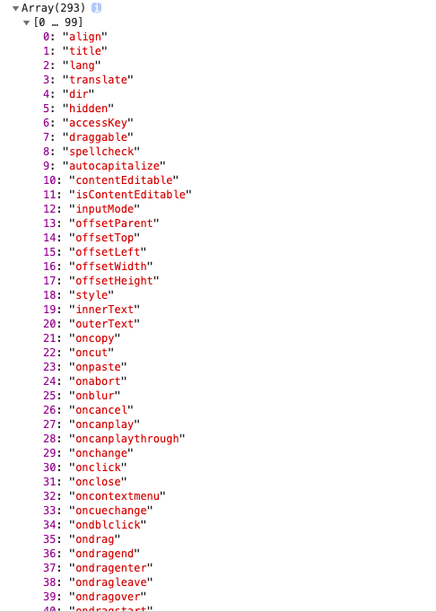
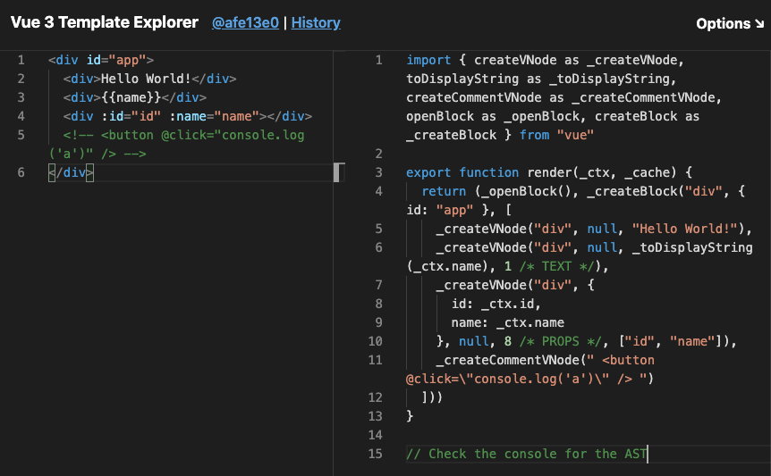

# Vue3 编译原理

## compile 编译原理

**前置知识**：
[编译原理](https://github.com/YongzeYao/the-super-tiny-compiler-CN/blob/master/the-super-tiny-compiler.js)

这边再次总结一下：

绝大部分的现代编译器的三个主要阶段：
- **解析**：将`源代码`转换成`抽象对象`
  - **词法解析** --> `词素`
  - **语法解析** --> `AST`（抽象语法树）
- **转换**：依据`抽象语法树`转换成代码表现形式的`新语法树`
- **代码生成**：依据新的`AST`生成`目标代码`

`compile`的大致过程：
- 1. `input`  == **`tokenizer`**   ==> `tokens`
解析源代码生成词素数组
- 2. `tokens` == **`parser`**      ==> `ast`
依据词素数组生成抽象语法树
- 3. `ast`    == **`transformer`** ==> `newAst`
依据AST生成新的AST
- 4. `newAst` == **`generator`**   ==> `output`
依据新的AST生成新的代码

整个`compile`函数的定义：
```js
function compiler(input) {
  let tokens = tokenizer(input); // 解析源代码
  let ast = parser(tokens); // 生成抽象语法树
  let newAst = transformer(ast);  // 转换成新的语法树
  let output = codeGenerator(newAst); // 生成新代码

  // 返回输出！
  return output;
}
```

## compile 历史
### 早期
`jquery`库对`DOM`增减改查，没有模版的概念
```js
// jquery
$(...).html(...);
```

### 中期 - 模版时代（13、14年之前）
`underscore`，`batempalte`等模版框架  
在`html`的模版中使用不同符号来标记`变量`和`js语法`

```html
<script src="underscroe.js"></script>
<script type="text/template" id="tpl">
  <ul class="list">
    <% _.each(obj, function(e, i, a){ %>
      <% if(i === 0) %>
        <li><%= e.name %>
      <% else if ( i === a.length - 1) %>
        <li class="last-item"><%= e.name %></li>
      <% else %>
        <li><%= e.name %></li>
    <% }) %>
  </ul>
</script>

<script>
var data = [{name: "tom"}, {name: "jerry"}];

// 编译过程
var compiled = _.template(document.getELementById("tpl").innerHTML);
var html = compiled(data);
document.querySelector("div").innerHTML = html;
</script>
```

使用`_.template()`解析上面的模版字符串，解析完成后将`data`传进`compile`函数内，最终插入`html`

原理就是对字符串编译，拼接成js函数，然后用`new Function`直接转换成函数使用

缺点： 
- 一旦数据变化，全量需要重新渲染，损耗性能

#### 成本过高的dom操作
之前的模版方案每次重新渲染的成本太高，而这是浏览器的架构所决定的，因为浏览器的`dom`的属性非常多

创建一个新的简单的`div`，然后现实查看这个`div`标签的所有属性
```html
<body>
  <div id="app">hello</div>

  <script>
    let el = document.getElementById('app');
    let arr = [];
    for(let key in el){
      arr.push(key);
    }
    console.log(arr)
  </script>
</body>
```
查看`console`  
  
可以看到一个简单的`div`标签就有`293`个属性，**所以`dom`操作的频率和次数对性能的影响是非常大的**


### 现期 - `mvvm`时代
因为`dom`操作成本过高，`react`提出了`虚拟dom`（`vdom`）  
`vdom`（`virtual dom`）可以实现按需渲染，大大降低性能的损耗

#### vdom的逻辑
- 使用`js对象`来描述`标签`
- 数据修改时， 不再全部重新覆盖，`js`会先进行一次`dom diff`，然后计算出需要修改最小的一部分
- 实现按需更新

这样就相当于**在`template`和浏览器之前用`js`加了一层缓存**

`vdom`其实就是用一个`js对象`去描述一个`标签`（包括它所拥有的属性）
一个🌰，对应刚才创建的`div`，那么它对应的`vdom`大致上是
```js
let vdom = {
  type: "div",  // 标签类型
  props: {id: "app"}, // 标签属性
  children: ["hello"] // 标签子内容
}
```

#### vdom的创建
通过`vdom`创建出真实`dom`节点并显示在网页上，其过程大致如下
```js
// 创建vdom
function createElement(type, props, chidlren){
  return {type, props, children}
}
// 渲染 将vdom -> dom
function render(dom){
  let el = docuemnt.createElement(dom.type);
  for(let key in dom.props){
    el.setAttribute(key, dom.props[key])
  }
  dom.children.forEach(child => {
    child = (typeof child === ' object') ? render(child) : document.createTextNode(child);
    el.appendChild(child)
  })
  return el
}

// 实际操作🌰
// 创建新的ul的vdom
let vdom = createElement('ul', {class: 'list'}, [
  createElement('li', {class: 'item'}, ['item1']),
  createElement('li', {class: 'item'}, ['item2']),
  createElement('li', {class: 'item'}, ['item3']),
  createElement('li', {class: 'item'}, ['item4']),
])
// 渲染vdom -> dom
var el = render(vdom);
// 将dom插入html
document.body.appendChild(el)
```
然而像`ul`，`li`这样的`vdom`创建写法非常麻烦  
所以`template` -> `vdom` 应运而生  
而这就是`vue3`等现代前端框架的`compile`所做的事情  

## vue3 compile

和所有的编译差不多，`vue3`的`compile`也是先分析出`AST`树，再将`AST`转换成代码（`render`函数：`vdom`生成函数）

即写得是`template`，通过`compile`返回的是`vdom`生成函数

[@vue3/compiler-core 模块源码](https://github.com/vuejs/vue-next/tree/cf2f278f48e21ff8e2a325c09eb0c7ab5bf5a1f4/packages/compiler-core/src)

以下网址是官方展现的在线编译过程参考，
可以在上面看到`AST`和最后拼接出来的`function`代码
[vue3在线编译](https://vue-next-template-explorer.netlify.app/)


`compile`主要模块：[源码](https://github.com/vuejs/vue-next/blob/cf2f278f48e21ff8e2a325c09eb0c7ab5bf5a1f4/packages/compiler-core/src/compile.ts)
- **`parse`** 将`template`转换成`AST`
- **`transform`** 对`AST`特定的一些语法做一些标记（`v-model`, `v-on`,`v-for`,`静态提升`等）
- **`generate`** 依据`AST`和之前的标记生成代码

### parse
[源码](https://github.com/vuejs/vue-next/blob/cf2f278f48e21ff8e2a325c09eb0c7ab5bf5a1f4/packages/compiler-core/src/parse.ts)

主要函数：
- `baseParse` [源码](https://github.com/vuejs/vue-next/blob/cf2f278f48e21ff8e2a325c09eb0c7ab5bf5a1f4/packages/compiler-core/src/parse.ts#L76)
- `parseChildren` [源码](https://github.com/vuejs/vue-next/blob/cf2f278f48e21ff8e2a325c09eb0c7ab5bf5a1f4/packages/compiler-core/src/parse.ts#L104)

主要就是循环遍历所有`template`，通过正则语法去匹配`template`中的字符，将`tempalte`转换成`ast`

识别范围：
- 动态标签
- 截止标签
- 动态文本
- 普通文本
- 标签属性

[核心识别语法](https://github.com/vuejs/vue-next/blob/cf2f278f48e21ff8e2a325c09eb0c7ab5bf5a1f4/packages/compiler-core/src/parse.ts#L113)

### transform
[源码](https://github.com/vuejs/vue-next/blob/cf2f278f48e21ff8e2a325c09eb0c7ab5bf5a1f4/packages/compiler-core/src/transform.ts#L262)

对`AST`中特定的一些语法做一些标记（`v-model`, `v-on`,`v-for`,`静态提升`等）

### generate
[源码](https://github.com/vuejs/vue-next/blob/cf2f278f48e21ff8e2a325c09eb0c7ab5bf5a1f4/packages/compiler-core/src/codegen.ts#L180)

`generate`实际就是根据之前标记的`option`和`ast`不断的拼接字符串，最终拼接出`vdom`生成函数
  
参考[vue3在线编译](https://vue-next-template-explorer.netlify.app/)可以看出，右边的`render`函数和内部的`_createVNode`函数都是`generate`函数拼接出来的


