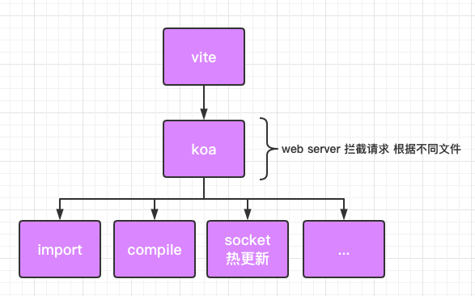

# Vite

[源码](https://github.com/vitejs/vite)

>`Vite`，一个基于浏览器原生 `ES imports` 的开发服务器。利用浏览器去解析 `imports`，在服务器端按需编译返回，完全跳过了打包这个概念，服务器随起随用。同时不仅有 `Vue` 文件支持，还搞定了热更新，而且热更新的速度不会随着模块增多而变慢。针对生产环境则可以把同一份代码用 `rollup` 打包。虽然现在还比较粗糙，但这个方向我觉得是有潜力的，做得好可以彻底解决改一行代码等半天热更新的问题。 (via 尤雨溪微博)

*读音：/vit/ 法语读音*  

- 新一代开发工具
- 利用浏览器自身的`import`功能，按需加载
- 无论项目内部逻辑多复杂，启动时间复杂度都是O(n)

## 体验Vite
全局安装该工具
```shell
sudo npm install -g create-vite-app
```

新建项目
```shell
create-vite-app #项目名
```

进入项目目录
```shell
cd #项目目录
```

安装环境
```shell
npm install
```
启动项目
```shell
npm run dev
```

### ES module
项目目录
```shell
.
├── index.html  # 页面模版
├── node_modules
├── package-lock.json
├── package.json
├── public
└── src # 项目文件夹
```
发现在根目录比传统多了一个`html`文件  
在`./index.html`模版中  
```html
<body>
  <script type="module" src="/src/main.js"></script>
</body>
```
可以看到`script`标签使用了浏览器自带的新功能`type="module"`

当声明一个`script`标签类型为`module`时，浏览器将对其内部的`import`引用发起 `HTTP` 请求获取模块内容，获取到内容之后再执行

### vite 原理
根据上述的浏览器新特性，不难看出，`vite`的实现原理：

当浏览器根据`type="module"`的`script`标签中的`js`文件中`import`的文件发起`http`请求时，`vite`对其进行了拦截，并在后端进行相应的处理（比如将`Vue`文件拆分成 `template`、`style`、`script`三个部分），然后再返回给浏览器渲染即可

这样一来，产生了2点优势：
- 省去了打包步骤
- 实现了按需更新

### 与webpack的区别
原来的`dev`模式，也是采用了`webpack`打包成`bundle.js`文件  

`webpack`会使用`map`存放模块`id`和路径，使用 `__webpack_require__`方法获取模块导出

如果当其中一个文件做了修改，`bundle.js`就会重新进行打包进行热更新；如果依赖的文件越来越多，理论上，即使只改动一个文件，热更新的速度也会因为打包文件过多而变慢

`vite`因为利用了浏览器原生支持的`module`功能，所以不需要生成`bundle.js`，当项目依赖越来愈复杂的时候，热更新省去了打包的时间，直接重新编译修改文件进行热更新即可，其他文件则可以拿先前的缓存，理论上热更新的时间是不会随着依赖增多而增加的

并且，如果项目依赖的文件越来越多，`webpack`打包的`bundle.js`的文件大小也会越来越大，解决方法一般就是预打包并异步加载或者使用`tree shaking`避免打包进`bundle.js`

而`vite`因为利用了浏览器新特性，使得浏览器当前加载页面需要什么文件，就直接向后台要什么文件即可

### vite 实现逻辑



#### server
`vite`使用`koa`作为`web server`来拦截浏览器为了获取相关`module`发出的`http`请求

然后依据发出的`http`请求的文件类型，分别用相对应的插件来处理文件并返回

启动项目后，浏览器发出`localhost:3000/`请求经过静态资源服务器的处理会第一个获取到`/index.html`

```html
<!-- /index.html -->
<body>
  <div id="app"></div>
  <script type="module" src="/src/main.js"></script>
</body>
```

浏览器根据`script`标签去获取`/src/main.js`

```js
// /src/main.js
import { createApp } from 'vue'
import App from './App.vue'
import './index.css'

createApp(App).mount('#app')
```

然而浏览器无法根据`import { createApp } from 'vue'`中的`'vue'`这个路径来获取文件，所以`vite`需要对所有的`import`路径进行一个处理

#### import

- 在 `koa` 中间件里获取请求 `body`
- 通过 `es-module-lexer` 解析`资源ast` 拿到 `import` 的内容
- 判断 `import` 的资源是否是绝对路径，绝对视为 `npm` 模块
- 返回处理后的资源路径：`"vue"` => `"/@modules/vue"`

这部分代码在 `serverPluginModuleRewrite` 这个 `plugin` 中

@next 待续


## 自实现
相同根目录下新建`server.js
```shell
npm install koa --save
```

原理
在引入浏览器的app.vue文件中，
还会从template中引入一个render模块
这个模块会返回解析之后的render函数
这样就可以实现compile后发送请求给浏览器让浏览器解析文件


好处
vite只在开发环境中
build还是得用到webpack或者rollup
首页用到什么文件就import什么文件，天生的懒加载
webpack是全部打包放入内存

## 参考
[Vite 原理浅析](https://juejin.im/post/5eaeb6c4f265da7bae2f9914)